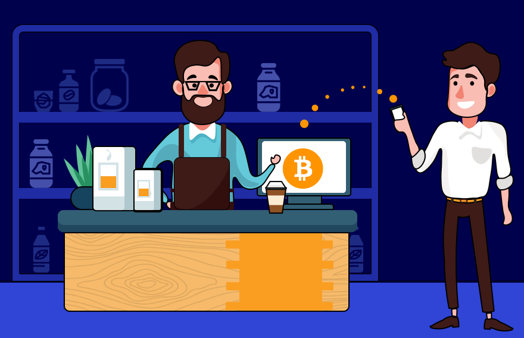
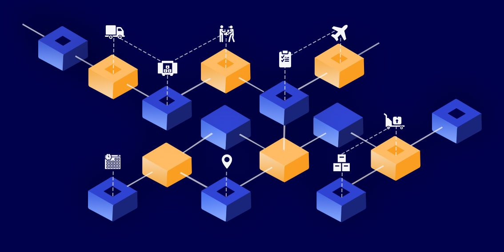

Experience matters most when your business depends on a great diversity of customers. Even a greater significance the experience gains when it comes to your regular customers: they purchase a combination
of your product and the positive experience you can provide. Retailers are under pressure from the e-shops nowadays since the latter can offer numerous new experiences to their online customers. The e-commerce websites turn the present gadget addiction into a competitive advantage.

They offer instant payments, one-click purchases, time-efficient searching through picturesque product catalogues, and even VR and augmented reality features. Does this mean that brick-&-mortar shops
are destined to become utterly anachronistic and leave the stage? Any chance to compete e-shops? How retailers can acquire the advantages provided by the digital era in general and by such a technology as <a href="https://indeema.com/blog/everything-will-be-blockchain" target="_blank">blockchain</a> in particular?

## Go digital or die

In the course of time, the <a href="https://anadea.info/blog/digital-transformation" target="_blank">digital transformation</a> is invading almost every aspect of our day-to-day routine. The majority of us are always connected through smartphones and wearables. The contemporary business leaders have intuitively grasped the situation long before it happened. And the leaders are what they are just because they managed to reshape their workflows in accordance with our present digitized environment.

E-commerce platforms like Amazon have revolutionized the way we shop by providing a personalized experience for each customer. In today's oversupplied market, personalization is the key to keeping up with the competition. By using sophisticated software solutions (for example, <a href="https://anadea.info/solutions/retail-software-development" target="_blank">custom retail software development</a>), these platforms can efficiently offer a vast range of products while catering to individual customer needs.

But what about offline retailers? Traditional advertising campaigns are no longer enough to stay competitive. In this digital age, retailers must adapt and embrace technology to blur the line between online and offline experiences. Automated newsletters and push notifications sent directly to our smartphones are just the tip of the iceberg. To stay ahead of the game, offline retailers must be flexible, efficient, and consumer-friendly. They must provide an experience that seamlessly blends the online and offline worlds, offering personalized recommendations and a shopping experience that feels tailor-made just for them. Only by embracing the latest technology and offering a personalized touch can offline retailers keep up with the demands of today's savvy consumers.

## Customization is the key

The present era of oversupply dictates the terms of personalization. The general formula of success within the e-commercial environment sounds simple: the more options for customization of the shopping experience you provide, the bigger confidence you generate in the eyes of your customers. However, such a modus operandi entails numerous challenges having purely technological constraints. You can add as many items to your product catalogue as possible, you can create dozens of options for a highly customized selection within your website, but all this can barely distinguish you from your numerous competitors who do the same actually.

No matter which type of shop you run - an e-store or a brick-&-mortar boutique - you will always have a competitor who offers the same having more customers (unless you are Walmart or Amazon). In such a
situation some specialty matters: your mobile application can generate customized notifications for your customers while they visit one or another area of your shopping center, or your e-commerce platform can aggregate some spatial data of your customers to offer them something relevant to buy here and now - the sky is the limit in the special features that can attract your clients.

## Why crypto is worth considering

Since the commercial success implies keeping your head always in the wind to apply some fresh technological know-how to your business, the growing significance of the crypto economy should be ignored under no circumstances. The simplest but still highly relevant practice is to offer your customers an option to pay with crypto currencies.

The ecosystem of cryptocurrencies has sufficiently evolved since 2008 when the first crypto Bitcoin appeared. Millions and millions of your potential customers throughout the world hold crypto in their wallets. Dozens of crypto exchanges provide trading with numerous crypto assets online on a round-the-clock basis. After years of the arrogant disregard and groundless criticism, the world banking system had to adopt cryptocurrencies as a viable financial asset which could outperform, by the way, the traditional fiat currencies in many aspects.

Thus, you look progressive when your payment options include crypto. It is easy to adopt crypto payment features if you use WooCommerce (the e-commerce software which runs up to 37% of all e-shops today), for example. The notorious volatility of many available cryptocurrencies should not embarrass you: it is always possible to fix your prices in fiat while the automated recalculation of the exchange rate of any crypto is provided by almost every available crypto wallet.

Whatever popularity one or another cryptocurrency can gain, you should not focus on the monetary aspect of blockchain alone, however. The distributed ledger technology can provide your retail business with various new capabilities far beyond just the payment in crypto.

Related article: [All You Need to Know About Public & Private Blockchains](https://anadea.info/blog/public-and-private-blockchains)

## 3 stunts retailers cannot pull off without blockchain

### 1. Control over entire supply chains

A proper monitoring of the entire supply chains does not refer to the customer experience directly. However, the way a retailer maintains the movement of goods from manufacturers through shipping agents and up to a particular store shelf can determine whether the goods find the customers or remain unsold.

A mess in the inventory management is what blockchain can help retailers successfully fight against. A dynamic, transparent, and error-free database can be created when all involved data providers can easily come to a consensus through some embedded algorithm. And nothing but leading to consensus is the core feature of any distributed ledger.

Moreover, the blockchain-powered inventory databases can do something utterly fantastic. They can combine seemingly incompatible things when all participants of the supply chains including both the
animate entities (companies and individuals) and inanimate objects (storage and transportation facilities equipped with the IoT sensors as well as the "active" always-connected package of the goods) can be
integrated into a synergetic system capable of providing retailers with an ultimately holistic picture of what is happening with their goods in real time.
The retailers won't need to rely on a risky human factor in the
inventory management anymore when the immutable blockchain-based databases work together with the <a href="https://indeema.com/blog/how-much-does-it-cost-to-create-iot-solution" target="_blank">IoT</a>.

### 2. Fair customer loyalty campaigns

The relationships between customers and retailers can be transformed into a partnership when the customer-friendly <a href="https://medium.com/nrf-events/4-ways-retailers-can-use-blockchain-to-their-advantage-1b4139a0b57d" target="_blank">loyalty</a> campaigns are properly designed. Coupons, bonus cards, discounts, rewards as well as any other type of the loyalty instruments will generate no friction between retailers and their customers when the entire procedure meets such basic requirements as to be transparent, fair, and trackable.

Once brand awareness is an essential part of any commercial success in retail, the stores whose loyalty programmes are ultimately transparent and fair can generate much bigger confidence in the eyes of their customers. The very immutability of the blockchain-based systems is the key feature capable of raising the customer loyalty to new levels. The customer care will always matter.

### 3. Unprecedented data privacy

What can fatally compromise an image of even the most popular and successful retailer is a leakage of the customers' private data. Even if the customers on their own allow the leakage happens due to their
neglect to some privacy settings, it will be a feeble excuse for the retailers since "the customer is always right". The fraud-free advertising system relying on an "iron-concrete" data security is what we all expect
from every progressive retailer. And since every progressive retailer collets consumer data today, the volume of the data is growing due to a quite "natural" intent of retailers to know more about their customers.

Indeed, the more you know about your customers, the better customization you can provide and, therefore, the bigger attention from the customers you may account on. Hence, data generates profit in
these days. But unlikely something other than the DLT can keep the private data sufficiently secure. The cryptographically encrypted decentralized database is to be a must-have feature for both the retailers and e-stores who care about their own reputation. The blockchain-based data security systems are creating a new trend in e-commerce now - the retailers should stand aside under no circumstances.

## Back on customer experience

The brick-and-mortar shops have only one crucial advantage over the e-stores in terms of customer experience - an opportunity to touch the goods, to feel a product when it is put on. However, such an advantage can become almost useless if retailers ignore the achievements of the digital era.

Such a disruptive technology as blockchain can enhance the retail business in its competition with e-shops. At the same time, such issues as the consumer data security, error-free inventory management, and transparent loyalty programmes have equal significance for both brick-and-mortar shops and e-stores. The new improved customer experience is what the DLT can provide to any kind of retail business.
