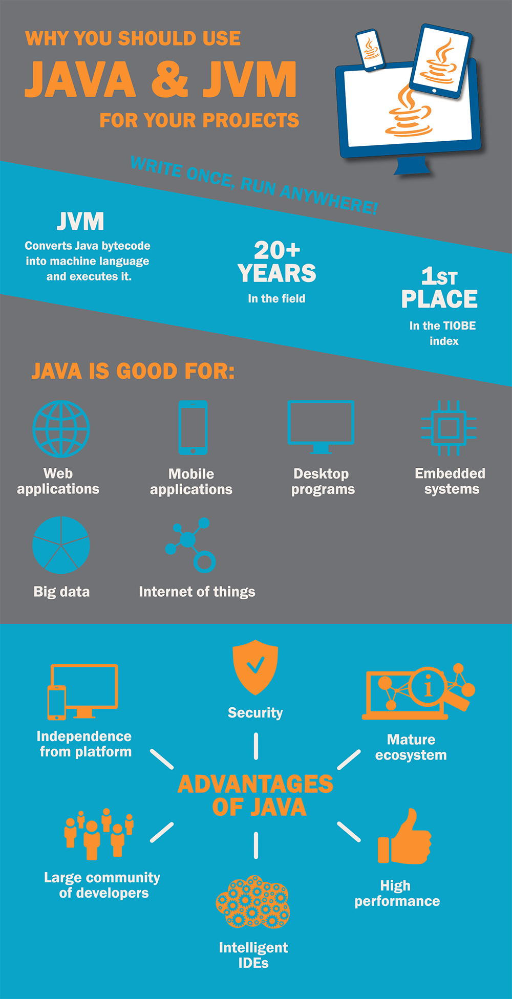

The history of Java began in 1995, when the first version of this programming language was released. "Write Once, Run Anywhere" (WORA) was the slogan of the new language. This meant that Java was not just another programming language, but a whole platform which you could use to build applications for everything, from powerful servers in data centers to a coffee machine in your kitchen.

## How does it work?

The programs written in Java, C, Go or any other programming language have to be translated to machine code to let computers understand them. However, different types of hardware and different computers speak different dialects of machine code. With most languages you have to translate the program into each dialect separately. It's not about Java!

The point is that instead of translating the program into machine code, the Java compiler converts it to an intermediate language called bytecode. And this bytecode is the secret ingredient. It is executed not on the hardware itself, but on a JVM (Java Virtual Machine). What is JVM and why it is needed? JVM is a special software that serves as a translator from bytecode to the language of machine code. Install a JVM on your phone - here's a mobile app. Want a web application? No problem, install Java virtual machine on the server and run your website with photos of pets.

It has been more than 20 years since the rise of the Java platform and you know what? It is still thriving and evolving. For many years, Java has been holding the first spot in the <a href="https://www.tiobe.com/tiobe-index/" rel="nofollow" target="_blank">TIOBE index</a> of programming language popularity, only sometimes giving way to the ancient titan of the programming world - the C language. So, what is so good about building applications for the JVM and why choose Java for your projects?

## Advantages of Java virtual machine

### Independence from platform

As mentioned above, applications written in Java can run on Windows, on Linux, or even on a refrigerator. The main thing is to have a JVM installed on the device.

### Security

Since a program written in Java runs inside a virtual machine, it is isolated from the operating system. No external process can access the application data if the virtual machine does not allow it. By the way, the security settings in the JVM can be flexibly configured, so the boundaries of what is permitted are under our complete control.

### A mature ecosystem and a massive community of developers

After 20 years of continuous development, Java has libraries and frameworks for every taste. A programmer does not need to reinvent the wheel, it is enough to take a set of existing solutions and assemble the required functional from them. For business owners, this means saving time and money on application development. It also ensures that there will be no shortage of Java developers.

### Modern multifunctional IDEs

Although this point is more important for developers, it improves their productivity. In its turn, this also reduces the development time. A good quality and well-tuned IDE is a continuation of the developer's hands, it allows him to focus on coding and to not worry about other stuff.

IntelliJ Idea, Eclipse and NetBeans are the three most popular IDEs for [Java application development](https://anadea.info/services/web-development/java) today. IDEs have a bunch of tools for the developer. They can integrate with libraries, frameworks, build systems, do lots of other things, except that they have not yet learned to make coffee. IntelliJ Idea, which is my IDE of choice, keeps on surprising me with unexpected useful features until now, even after 4 years of using it.

### Performance

Java has been around for over two decades and has continuously developed, improved, and optimized over the years. Today's Java not only matches the performance of modern programming languages such as Ruby or JavaScript, but it even surpasses them in terms of speed. Additionally, Java is well-equipped to support multiprocessor systems, making it an ideal choice for web and mobile applications that require maximum resource utilization.

With the prevalence of smartphones that have four, six, and even eight-core processors, Java's ability to support multiprocessor systems is especially relevant. If your web application experiences unexpected traffic, Java can handle it. With a vast collection of libraries and frameworks, you can easily scale your application, use multiple servers, and take advantage of cloud technologies to serve hundreds of thousands, if not millions of users without any delays.

### Not only Java

Some people say that Java is excessively verbose and lacks expressiveness. The thing is that Java has long been a purely object-oriented programming language and with time, the paradigm of pure OOP has outlived itself. The complexity of the systems being developed has greatly increased and the OOP itself is no longer able to cope with such complexity.

Fortunately, the paradigm of functional programming, emerged in the middle of the last century, came to the aid. Java was not quick to adopt the ideas of functional programming, so there began to appear other languages that used the FP to combat the complexity of systems and to give the language a more expressive syntax.

Among these languages are: functional to the core Clojure, dynamic Groovy, pragmatic Kotlin and Ceylon, reactive and scalable Scala. There are also numerous adaptations for JVM of other programming languages such as Ruby, JavaScript, Pascal, PHP and Python. Everyone can choose the language that suits them best for a quick and effective solution of tasks.

## Success stories

In support of the above, I would like to give a few examples of projects implemented by us on the Java platform.

### For education industry

**[STAV Online](https://anadea.info/projects/stav-online)** - an online platform for teaching and learning the national language in Danish schools. Training is conducted using the gamification technique: instead of books - game worlds and bonus points will be a reward to the diligent student. The teacher can track the progress of both the class as a whole and individual students. Since students and teachers work with the application mainly from tablets, the application is also adapted for mobile devices. At the moment, the application serves more than 10 thousand students and over a thousand teachers.

### For enhancing software development process

Nobody likes errors in applications and there are QA testers whose role is to find glitches and bugs. After detecting an error, testers have to describe its symptoms and steps to reproduce the bug. They can, of course, do this on paper, but we live in the age of digital technologies. Therefore, we developed the **QA Assistant** app for our testers, which provides a convenient interface for describing bugs, creating test scenarios, reporting and other QA activities.

### For game development

Everyone likes to play games and our developers are no exception. However, since we are not only players, but also software developers, we have some games written in Java in our portfolio as well. Here, for example, the clone of the **Plumber** puzzle in a somewhat unusual implementation. Instead of pipes are wires, instead of cranes - bulbs. The game is available on the <a href="https://itunes.apple.com/app/bulb-fiction/id973146040?mt=8" rel="nofollow" target="_blank">App Store</a>.

## Outcomes

JVM is a modern, mature, reliable and stable platform that allows developing applications of any complexity and purpose. Development on JVM saves time and money for the business owner, and also brings pleasure to the developer. A satisfied developer is an effective developer. Applications written for the JVM are safe, productive and reliable and they can be easily transferred to various hardware platforms.

Is it worth to develop your product in Java? Definitely it is! At least try it, you will like it.
