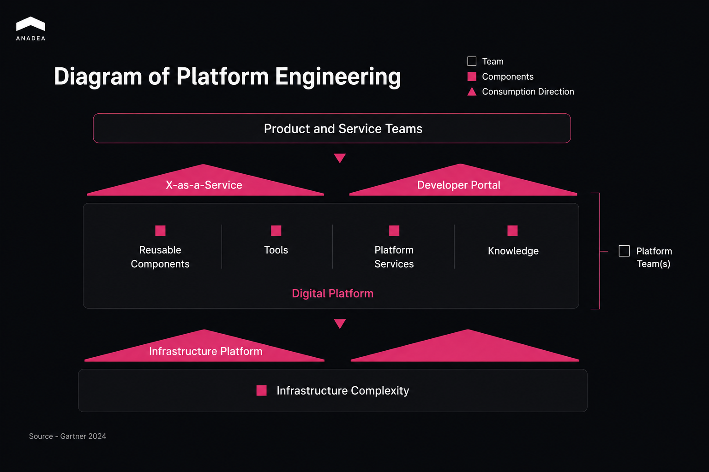

Platform engineering is how growing development teams stop reinventing the same infrastructure and start shipping through a shared internal platform. This article breaks down what that platform includes, where platform engineering parts ways with DevOps, which tools teams actually reach for, and how to stand up your first platform team without over-engineering it. 

Most development teams hit a wall somewhere past twenty engineers. The CI/CD setup that worked fine for three squads starts to crack across ten. Environments drift apart. Deployments pile up in a queue. A new hire spends the better part of two weeks just getting to their first shipped feature, and the ops team that used to unblock everyone is now the thing everyone waits on.

Platform engineering is the discipline of building an internal developer platform that hides infrastructure complexity so product teams can serve themselves. At most companies it is also a team. Its product happens to be the platform rather than anything a customer ever sees.

The idea grew straight out of DevOps. DevOps fixed the old standoff between developers and operations. What platform engineering adds is what you need once those same practices have to work across twenty, thirty, fifty teams at the same time. And the shift is already happening at scale. [Gartner forecast](https://www.gartner.com/en/newsroom/press-releases/2025-10-20-gartner-identifies-the-top-strategic-technology-trends-for-2026) that 80% of large software engineering organizations would run dedicated platform engineering teams by 2026, up from 45% in 2022.

## What Does a Platform Engineering Setup Actually Look Like?

A platform engineering setup centers on an internal developer platform that exposes infrastructure as self-service interfaces, built and run by a small dedicated team. Four ideas hold the whole thing together.

Start with the platform itself. An internal developer platform covers deployment pipelines, environment provisioning, secrets management, and observability. All of it sits behind interfaces a developer can actually use without opening a ticket. 

The second idea is treating the platform as a product. A team that takes the platform as a product seriously keeps a roadmap, publishes service levels, and sits down with the developers who use the thing. Most internal tooling never gets that treatment. That is usually why most internal tooling goes unused, and a platform with no users earns its keep about as well as an abandoned wiki.

Third are golden paths. A golden path is a pre-built, opinionated workflow for something a developer does over and over, like deploying a service, spinning up a database, or scaffolding a new microservice. Teams can step off it when they have a real reason to. They rarely bother, because the golden path is already the fastest route and it passes compliance on its own.

Fourth is self-service, with automation doing the work underneath. The platform team builds something once and every product team draws on it without waiting in line. Infrastructure-as-code templates, automated provisioning, CI/CD abstractions, all of it deletes the raise-a-ticket-with-ops step that quietly caps how fast a growing team can move. That step is one of the more common [engineering bottlenecks](https://anadea.info/blog/engineering-bottlenecks/) nobody puts on a roadmap.

## Platform Engineering vs DevOps: What Is the Difference?

They differ in scope and in form, and neither is the better one. DevOps is a culture, a set of practices that tore down the wall between development and operations. Platform engineering is what an organization does about scale. Once dozens of teams all need those DevOps practices, somebody has to build and maintain the shared tooling that hands them out. DevOps is a shift everyone makes together. Platform engineering is a product team that serves everyone else. So when people ask how to read the platform engineering vs devops question, the short version is that platform engineering takes DevOps and makes it an actual thing you can operate on.

<table>

<thead>

<tr>

<th></th>

<th>

<strong>DevOps</strong>

</th>

<th>

<strong>Platform engineering</strong>

</th>

</tr>

</thead>

<tbody>

<tr>

<td>

Primary goal

</td>

<td>

Break down dev and ops silos

</td>

<td>

Build shared internal tooling at scale

</td>

</tr>

<tr>

<td>

Who it is for

</td>

<td>

All engineers adopting a shared culture

</td>

<td>

A dedicated platform team serving product teams as customers

</td>

</tr>

<tr>

<td>

Main output

</td>

<td>

CI/CD pipelines, automated testing, shared practices

</td>

<td>

An internal developer platform

</td>

</tr>

<tr>

<td>

Team-size trigger

</td>

<td>

Applies from small teams onward

</td>

<td>

Emerges when the org grows past roughly 20 to 30 engineers

</td>

</tr>

<tr>

<td>

Success metric

</td>

<td>

Deployment frequency, lead time, MTTR

</td>

<td>

Developer experience, self-service adoption, onboarding time

</td>

</tr>

</tbody>

</table>

The people in the middle of this growth feel it before any chart shows it. On one [practitioner forum](https://tianpan.co/forum/t/platform-engineering-devops-evolution-or-just-rebranding-when-do-you-actually-need-it/3744), an engineer scaling a team from 50 to 120 over eighteen months described the DevOps practices that got them there starting to crack, and how past a certain size the everyone-does-DevOps approach stops producing ownership and starts producing chaos. Nobody on that team stood up on a platform because it was fashionable. They did it because the old way had quietly stopped working.

## How Do Development Teams Get Started with Platform Engineering?

Start at the point in your workflow where the most time leaks out, before you sketch any grand platform vision. Sit with a few developers and find where the hours actually go. Usually it is onboarding, or environments that never quite match, or the deploy queue. Build around that pain. The fastest way to waste a quarter is to build an elegant platform that solves a problem nobody on the team actually has.

1. Form the team before you build anything. Two or three engineers pointed at internal tooling already changing things, because the work stops being a side quest jammed between feature deadlines. The team needs engineers, and it needs at least one person with a product instinct, the kind who asks who is going to use this and why before any code gets written. Skip that person and you end up with a pile of tools instead of a platform anyone reaches for.
2. Then pick one golden path and ship it. The deployment pipeline is usually where the return is highest, since it touches every team every single day. Get it adopted, listen to what breaks, and only then move on to the next path. Trying to standardize everything at once is what drowns most early platform efforts before they show any value.
3. Measure the things that actually track cognitive load. Time-to-first-deploy for new hires tells you something real. So does deployment frequency, and so does the count of infrastructure tickets product teams still have to file. Pipeline speed is one signal among several. What you are really chasing is a lighter mental load on the people building your product, and that is harder to put on a dashboard than it sounds.
4. A concrete case makes the shape clearer. Picture a fintech scale-up that grew its engineering org fast over about a year and a half. Every squad had drifted into its own Terraform config, deployments had turned into a multi-hour ritual, and new hires burned their first days wiring up an environment before they could write a line of code. Two engineers, working as a platform team, standardized the deployment pipeline first. 

Then they shipped a self-service environment tool, and onboarding dropped from weeks to days. The next quarter they built a golden path for new microservices, and the steady drip of infrastructure tickets into the ops team started to dry up as squads stopped needing to ask. The investment was small. It just had to be dedicated. If the part you are stuck on is finding those two engineers, [staff augmentation](https://anadea.info/services/staff-augmentation) is one way to stand up a platform team without waiting out a full hiring cycle.



## What Platform Engineering Tools Do Teams Actually Use?

The platform engineering tools teams actually fall into five categories, and the real list is shorter and more settled than the vendor pitches suggest. The developer portal is usually Backstage, which bundles a service catalog, a scaffolder for new projects, and TechDocs into one front-end for the platform. For infrastructure as code, Terraform and its open-source fork OpenTofu handle most cloud provisioning, though Pulumi has a following among teams who would rather write infrastructure in a real language than in HCL. CI/CD tends to be GitHub Actions for most pipelines, Argo CD for GitOps deployment onto Kubernetes, and Tekton when a team is building custom pipelines straight on K8s. Observability still leans on Grafana and Prometheus for metrics and alerting, with OpenTelemetry creeping in underneath as the vendor-neutral instrumentation layer. Secrets stay out of source code through HashiCorp Vault or a cloud-native stand-in like AWS Secrets Manager.

One rule keeps this from turning into shelfware. Treat the stack as a means to a [developer experience platform](https://anadea.info/blog/engineering-bottlenecks/), not as a checklist of tools to collect. The table groups the categories for quick reference.

<table>

<thead>

<tr>

<th>

<strong>Category</strong>

</th>

<th>

<strong>Common tools</strong>

</th>

<th>

<strong>What it does</strong>

</th>

</tr>

</thead>

<tbody>

<tr>

<td>

Developer portal

</td>

<td>

Backstage

</td>

<td>

Service catalog, scaffolder, and docs in one front-end

</td>

</tr>

<tr>

<td>

Infrastructure as code

</td>

<td>

Terraform, OpenTofu, Pulumi

</td>

<td>

Provisions cloud resources from version-controlled code

</td>

</tr>

<tr>

<td>

CI/CD

</td>

<td>

GitHub Actions, Argo CD, Tekton

</td>

<td>

Builds, tests, and deploys, often via GitOps to Kubernetes

</td>

</tr>

<tr>

<td>

Observability

</td>

<td>

Grafana, Prometheus, OpenTelemetry

</td>

<td>

Metrics, alerting, and vendor-neutral instrumentation

</td>

</tr>

<tr>

<td>

Secrets and config

</td>

<td>

HashiCorp Vault, AWS Secrets Manager

</td>

<td>

Keeps credentials out of source code

</td>

</tr>

</tbody>

</table>

## Conclusion

The honest answer to where to begin is wherever the friction is worst in your own workflow, and the only way to know that is to ask the developers living with it. Often the groundwork comes first. If technical debt and tooling sprawl are dragging on every release, clearing some of that is what makes a platform stick once you build it, and the same habit that keeps [technical debt](https://anadea.info/blog/how-to-manage-technical-debt-in-mobile-apps/) under control is what keeps a platform healthy over the years. And if waiting out a hiring cycle to assemble that first team is the blocker, [talk to our team](https://anadea.info/services/staff-augmentation) about standing one up quickly.
