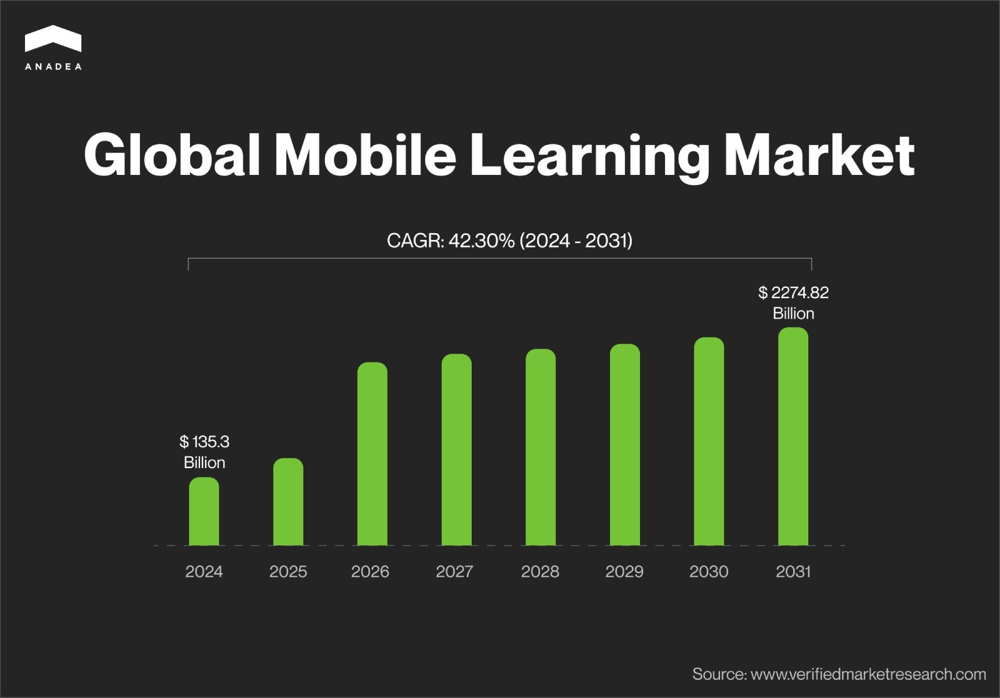
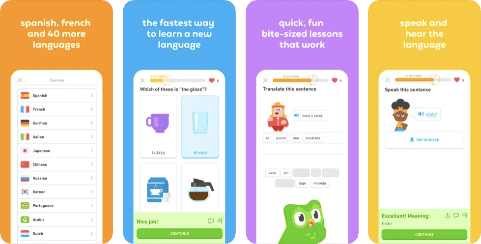
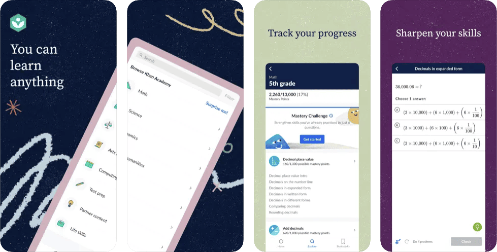
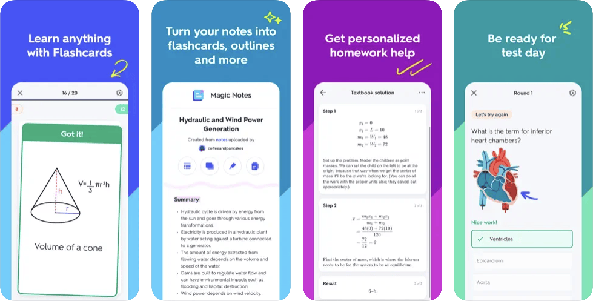
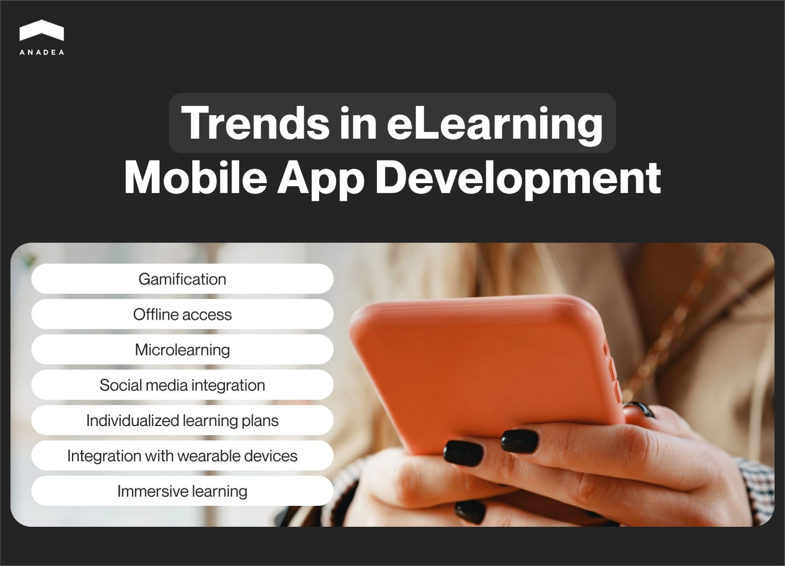

Today to learn something new, it’s not always required to attend traditional lessons. Quite often, it will be enough just to download a relevant mobile app and enjoy the process: study materials in various interactive formats, play games, test your knowledge in quizzes and compete with other users for the first positions on the leaderboard. [eLearning mobile app development](https://anadea.info/solutions/e-learning-software-development/m-learning) helps education become more digital and less formal. In this article, we are going to share our expertise in this sphere and provide practical tips for those who have plans to launch a custom e-learning mobile application.

## Mobile learning apps: Market overview 

While paper notebooks and traditional textbooks are losing their popularity, digital solutions are gradually winning a bigger market share. One of the main factors behind this trend is the convenience that learning at any place and at any time can offer.

Mobile learning can be defined as education delivered with the help of mobile devices like smartphones and tablets. Such solutions usually ensure multi-device support, which allows students to get access to educational materials practically from everywhere, even when they do not have access to their own devices.

Mobile apps can also facilitate such processes as submitting assignments, checking knowledge, learning new information, and cooperating with other students online. With such an application at hand, students are allowed to learn at their own pace and enjoy the benefits of content personalization.

The mobile learning market is actively expanding. In 2024, it is [valued](https://www.verifiedmarketresearch.com/product/global-mobile-learning-market-size-and-forecast/) at over $135 billion and experts project that by 2031, it will hit the mark of $2274.82 billion. It means that the expected CAGR for the period under consideration will be over 42%.

## Types of e-learning mobile apps

Given the variety of users’ learning needs and spheres of interest, today there is a wide range of educational mobile applications. Let us focus on the most popular ones.

* **Language learning apps**. These applications are the most widely used ones in this category. Though they have some obvious drawbacks compared to traditional lessons, their efficiency also deserves much praise. Such applications usually offer small modules for learning new vocabulary, studying various grammar concepts, and improving such skills as listening, reading, and writing.
* **Corporate training apps.** Corporate education is an important aspect of many organizations. And mobile technology allows companies to facilitate this process of employees. Instead of reading huge articles or attending lectures, people can learn the required information from the app at any time and at any place that is convenient for them. Moreover, employers can hold various tests and quizzes to check the skills of their team members and evaluate the general level of their knowledge.
* **Apps for children**. Modern mobile apps can be enriched with all the required features for developing such basic skills as logic, critical thinking, problem-solving, creativity, etc. Moreover, via mobile devices, it is possible to introduce various interactive learning activities for covering traditional school subjects, like mathematics, languages, biology, geography, history, etc. Thanks to interactive formats, children can better understand and memorize even the most complicated concepts.
* **Specialized learning apps**. This sub-category can include various applications aimed at helping users develop some particular skills, like coding. Very often such apps can be used as supportive tools in the framework of full-scale courses.



## The most well-known educational mobile apps

The market of mLearning apps is an actively expanding one. Nevertheless, the success of the existing businesses and the continuously growing interest from the side of users in such solutions brightly demonstrates that the current moment can be a very good time for introducing new projects.

### Duolingo

Duolingo is an educational tech company, mainly known for its mobile app and website that rely on a gamified approach to language learning. It offers lessons that include interactive exercises and quizzes. It is powered by an algorithm that allows users to enjoy high personalization in the learning process.

At the moment, there are courses in 43 languages.

In 2023, Duolingo [generated](https://investors.duolingo.com/news-releases/news-release-details/duolingo-reports-65-dau-growth-45-revenue-growth-and-record) $531 million in revenue which is a 43.6% year-on-year increase.

### Khan Academy

Khan Academy offers users access to classes in a wide range of subjects, including but not limited to math, art, programming, economics, and others, for students of different ages. It has a website and official iOS and Android apps that are all 100% free.

Khan Academy is a non-profit organization and its main source of funding is donations. According to various sources, the organization’s annual revenues are in the range between $15 million and $30 million.

### Quizlet

This app has a quite impressive history which began almost 20 years ago. The concept of flashcards for learning may seem to be too simple but it has already proven its efficiency. Moreover, over time it has experienced some important updates. Today, the app is powered by AI which makes the process of learning even more result-oriented. Users can choose from 700+ million digital flashcard sets or create their own.

According to the company’s [website](https://quizlet.com/mission), every month over 60 million people use Quizlet.

## Common features of mobile learning apps

The functionality for your app should be chosen given the target audience and the exact goals of your product. Nevertheless, some features are included in the majority of modern solutions of this type. If you have some ideas for an eLearning mobile app development project, consider the following list.

* **Learning materials.** They can be available in different formats, like articles, videos, and podcasts. Moreover, there can be a list of resources where students can find helpful information.
* **Plan of studies**. As a rule, such apps provide a clear roadmap that will guide the learning journey. Users should fully understand their progress and the number of topics/lessons that are available to them.
* **Interactive content.** Quizzes, flashcards, tests, surveys, and various exercises are aimed at maintaining engagement and making learning more interesting.
* **Social features.** Forums, chats, and group projects can facilitate peer interaction and collaborative learning.
* **Reminders and alerts.** You can add various notifications that will encourage regular study habits and keep users informed of new content added or the set deadlines for completing their tasks.

Request estimate

## Trends in e-learning mobile app development

The industry standards, as well as users’ expectations, are gradually changing. Today, the apps that were released 7-10 years ago (if not timely updated) will look and feel obsolete. This principle is relevant not only to the design of applications but also to their functionality, logic, and possibilities. That’s why it is crucial to monitor the market trends and consider them while building your solution.

* **Gamification**. Thanks to engaging challenges, competitions, missions, rewards, and bonuses, the process of learning new things will become a real pleasure for users of all ages. You can read more about the ways to enhance student performance with a mobile app [here](https://anadea.info/blog/5-surprising-ways-educational-apps-can-help-improve-students-performance).
* **Offline access.** You can make it possible for users to continue interacting with your app even when their internet connection is not stable enough.
* **Microlearning**. By breaking down learning material into smaller, manageable segments, you can facilitate on-the-go learning.
* **Social media integration.** The possibility to share progress, achievements, and learning content on social media platforms can greatly motivate a lot of people to conquer new peaks in their studies.
* **Individualized learning plan.** Thanks to AI models, you can create unique learning journeys tailored to the users’ needs and pace.
* **Integration with wearable devices**. You can utilize wearables to incorporate physical activity into learning and/or provide real-time feedback to users.
* **Immersive learning and simulations.** AR and VR can create immersive environments for effective learning of such subjects as science, history, and medicine among others.

### AI power in e-learning apps

Artificial Intelligence is one of the key technologies that are expected to revolutionize the world of education in general. Will it fully replace teachers? Probably not, at least not in the near future. Nevertheless, it can become an extremely powerful tool that can increase the efficiency of the learning process. Here is how you can apply AI/ML-based tools to enhance your app.

* **Personalized recommendations**. AI can analyze users’ preferences and needs to offer them the materials and formats of exercise that will be the most helpful for them.
* **Virtual assistant**. AI-powered chatbots can not only answer some process-related questions but also help with practical tasks and explain the same topic in different words to make it better understandable.
* **Speech-to-text and text-to-speech tools.** Such features can ensure a hands-free experience and allow users to continue learning even when they are driving a car or are busy with housework.
* **AI-powered analytics.** Your app will be able to monitor the progress of each student, detect his or her weak and strong sides, and generate comprehensive reports for teachers.



## E-learning mobile app development process

If you want to launch your own app for learning, here’s a brief to-do list for you.

1. Analyze the market to detect users’ needs.
2. Detect your target audience.
3. Develop a concept of your future app, and think about its goals and functionality.
4. Prepare your requirements.
5. Find an eLearning mobile app development company or discuss your project with in-house developers.
6. Plan the process of your project realization, set milestones, and define your budget and timelines.
7. Start with the development of an MVP. Though this step is not an obligatory one, it can help you to reduce your financial risks. With it, you can be sure that your app will be positively welcomed by your target audience.
8. Proceed to design and development of a full version of your app. Your participation in this process can vary depending on the engagement model that you will choose.
9. Properly test your solution and prepare it for release.
10. Make your app available to potential users on Google Play and/or App Store.
11. Monitor the performance of your app.
12. Regularly update its content and improve its functionality.

You can find more detailed recommendations on how to build an eLearning solution in one of our previously published blog articles by [following the link](https://anadea.info/blog/create-online-learning-platform).

## Native or cross-platform e-learning mobile app?

One of the main tech-related decisions that you will need to make is whether your app will be native or cross-platform.

Native apps are developed specifically for a single platform, either iOS or Android. Cross-platform apps are built with the help of frameworks that allow the same codebase to be deployed on multiple platforms.

It is impossible to say which approach to app development is better as both of them have pluses and minuses. Your decision should be based on the needs and peculiarities of your project.

<table>
    <tr>
        <th></th>
        <th>Native apps</th>
        <th>Cross-platform apps</th>
    </tr>
    <tr>
        <td>Advantages</td>
        <td>
            <ul>
                <li>Performance optimized for a specific platform</li>
                <li>Superior user experience</li>
                <li>Full access to device-specific features like GPS or camera</li>
                <li>Enhanced security features</li>
                <li>Better stability and reliability</li>
            </ul>
        </td>
        <td>
            <ul>
                <li>Single codebase for multiple platforms</li>
                <li>Reduced development and maintenance costs</li>
                <li>Faster development</li>
                <li>Consistent user experience across different platforms</li>
                <li>Facilitated management of development resources</li>
            </ul>
        </td>
    </tr>
    <tr>
        <td>Disadvantages</td>
        <td>
            <ul>
                <li>More expensive and time-consuming development (if you need two separate apps)</li>
                <li>Support of two codebases</li>
                <li>Higher ongoing maintenance costs</li>
            </ul>
        </td>
        <td>
            <ul>
                <li>Dependency on the capabilities of the chosen cross-platform framework</li>
                <li>Limited access to some device-specific features</li>
                <li>Less seamless performance and user experience</li>
            </ul>
        </td>
    </tr>
</table>

Given the peculiarities of both types of mobile software, it is sensible to choose each of them in the following situations.

Native app development should be chosen when:

* You have a complex app and its performance is a critical factor;
* To provide the required functionality, you need to have full access to platform-specific features;
* You want to ensure the best possible user experience for each platform.

You should consider cross-platform app development when:

* You need to release your app for several platforms as quickly as possible;
* The functionality of your application is rather straightforward and it doesn’t heavily rely on platform-specific features;
* Consistency across platforms is crucial;
* You have a limited budget.

Related read: <a hrefs="https://anadea.info/blog/native-vs-cross-platform-app-development">Native vs Cross-Platform App Development: Our Practical Experience</a>

## Tech stack for e-learning mobile app development

Here is a list of the most popular technologies used for building mobile e-learning solutions.

* iOS app development: Swift, Objective-C, SwiftUI, CocoaPods, XCode, IOS SDK;
* Android app development: Kotlin, Java, Gradle, JetPack, Android Studio;
* Cross-platform app development: React Native, Flutter, Xamarin;
* Backend development: Node JS, Python, PHP, Java, Golang, Ruby;
* Frontend development: Angular, React, JavaScript, HTML, CSS;
* Database: MySQL, MongoDB, PostgreSQL;
* Cloud platform: AWS, Microsoft Azure; Google Cloud;
* Push notifications Onesignal, Firebase;
* Payments: Stripe, PayPal;
* Messaging features: Twilio;
* Real-time analytics: Apache Spark, IBM.

If you are not sure what technologies and tools should be used for your app, the development team will help you make the right choice.

## Cost of e-learning mobile app development

The cost of your project realization will be calculated based on your requirements.

Before naming even approximate figures, developers should understand:

* which type of mobile software you are going to launch (native or cross-platform);
* what features your app would have;
* what requirements for its UI design you have;
* what integrations are needed.

The development of more complex apps takes much more time than the creation of small applications with basic functionality and, consequently, the costs in the first case will be higher.

Usually, the costs of such projects start at approximately $30,000. However, if you want to launch an advanced application with AI-powered and other innovative features, the project budget can reach $70,000 and more.

<a id="Blog-button" class="btn btn--secondary header-button " href="/contacts" style="color:white; text-decoration: none" target="_blank">Ask about your project</a>

## How to find developers who will build an e-learning mobile application?

If a company doesn’t have in-house developers and doesn’t want to hire such specialists, the only possible solution will be to work with external programmers. There are two models that any business can opt for to cooperate with freelancers or with an e-learning mobile app development company.

These two variants have their advantages and disadvantages. For example, it can be easier to hire freelancers. Moreover, their services can be cheaper than those of a professional agency. Nevertheless, when it comes to better protection of your rights and guarantee of a high-quality final product, cooperation with an eLearning mobile app development company will be a better choice.

We recommend you work with freelancers when you have small tasks that should be done as quickly as possible. For serious projects, such as educational mobile app development, it will be more sensible to find a reliable vendor likeAnadea.

To do it, you can rely on professional platforms. For example, you can use Clutch or GoodFirms. There you can check the reviews and ratings, as well as find a lot of useful information about the expertise of the development agency, the technologies that its specialists work with, etc.

What factors should you pay attention to?

* Experience of the team;
* Its expertise in e-learning mobile app development and its portfolio;
* Reviews and rating;
* Available engagement models and terms of cooperation.

The question of development costs is also a very important one. Nevertheless, as we have already mentioned, the necessary amount for your project realization will depend on your requirements. That’s why before deciding on your possible cooperation with a firm, you should ask the team to analyze your project idea and provide you with an estimate. At Anadea, we always [do it for free](https://anadea.info/free-project-estimate).

## Our tips on how to launch a successful e-learning mobile application

With our expertise in e-learning mobile app development, we have managed to elaborate a row of practical recommendations that help to launch successful products.

1. **Understand the needs of your target audience.** It’s very important to make sure that you definitely know what needs of users your app will address. It is required to deeply analyze your target audience and define their values and key goals in learning.
2. **Set clear goals.** When you are working on the concept of your solution, you should set very precise goals for your project. Based on this, you will understand how to position your application and what functionality to build for it.
3. **Take care of the quality of your content**. When it comes to educational mobile app development, it is crucial to focus not only on the technical aspect of your solution but also on the quality of the provided materials. That’s why in order to provide the best content, many startups closely cooperate with educational establishments, schools, and individual professors. You also need to regularly check whether the materials are relevant or whether you should update them with new data, figures, or facts.
4. **Allocate the budget for marketing and promotion of your app**. Even if you have a cool application, the project may fail due to poor marketing strategy. You should make your product visible to your target audience. That’s why it is important to find the most efficient ways to tell potential users about your application. You can establish cooperation with influencers, you can launch social media marketing campaigns, create a website for promotions, etc. The choice of the channels for promotion will greatly depend on the interests of your target audience.
5. **Continuously improve your solution**. When your app is released, you still have a lot of things to do. It is vital to track user sentiment, gather people’s feedback, analyze the changes in their needs, and try to address them with updates and new features as soon as possible.

## Final word

Looking for an eLearning mobile app development company? At Anadea, we are always open to new projects. Our specialists have rich experience in working with different projects from the education industry and deeply understand the current market trends. We can cope with the tasks of any complexity and will be happy to support your successful project realization.

If you want to learn more about our team, services, or terms of cooperation, do not hesitate to contact us.

Get in touch
