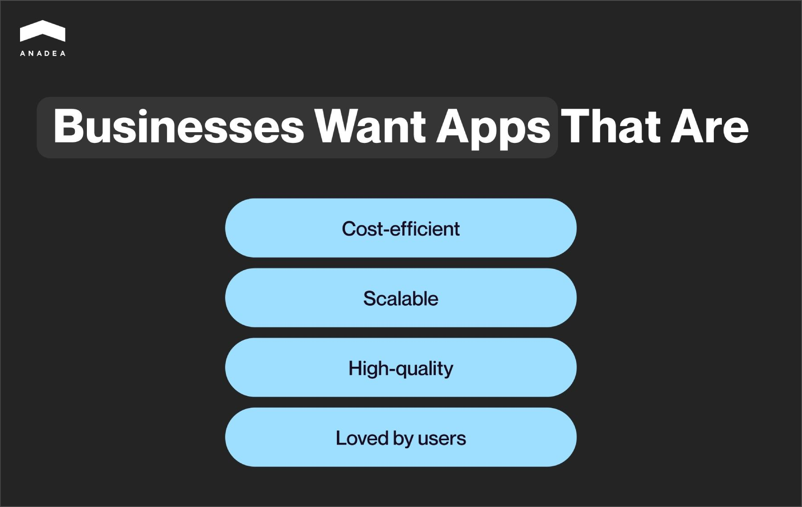
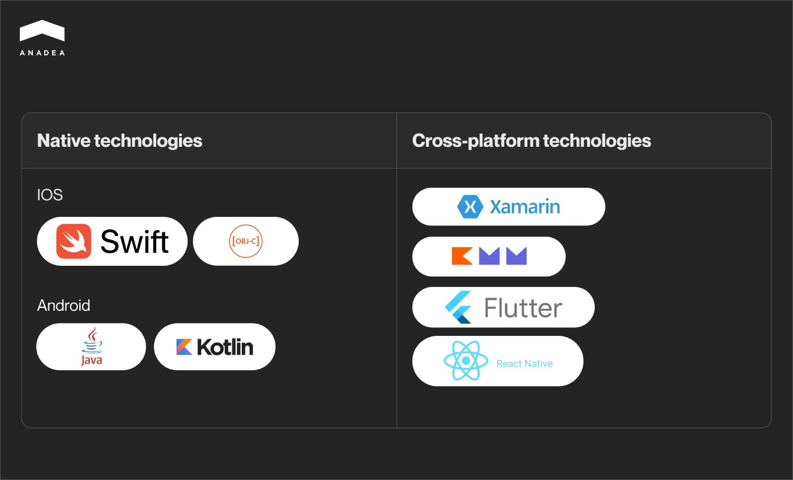
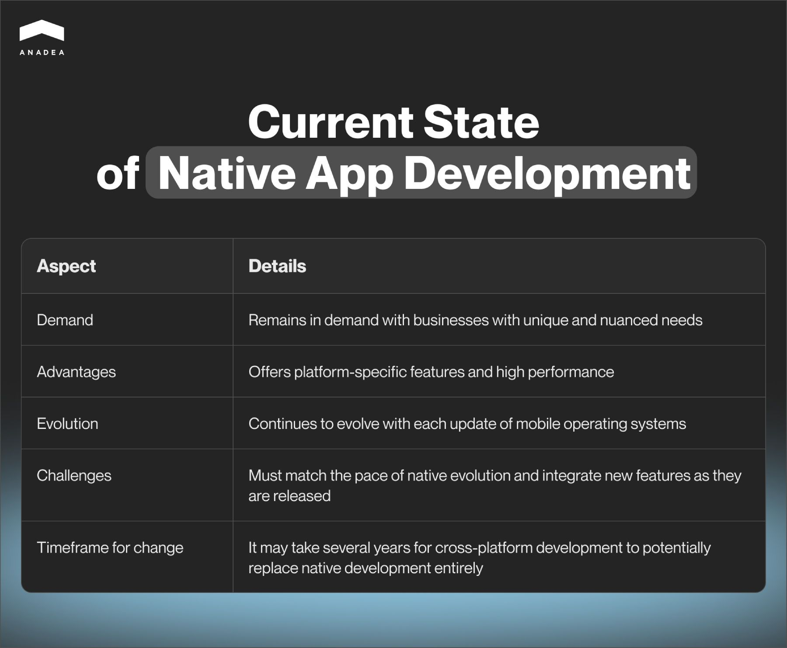

Mobile apps are on the rise, and choosing the right technology can make or break your project. Multiplatform solutions like Flutter, React Native, and Ionic have become very popular for their ability to work across multiple platforms. However, native [mobile app development](https://anadea.info/services/mobile-development) still holds its ground and shouldn't be overlooked.

Why stick with native development when cross-platform solutions are often seen as more cost-effective? When can native development be cheaper than cross-platform, and when is it not? And most importantly, when should you choose native over cross-platform development? We'll explore these questions in this article.

## What do businesses expect from mobile development?

To determine the best technology stack, it's important to understand what businesses value most. From our perspective, these key aspects include:

* Cost and time of app development or rewriting;
* Cost and time of predictable further maintenance, where it’s possible to predict;
* Flexibility of the product, which defines the possibility of applying new specific features;
* Quality of the final product, which affects the cost of further maintenance;
* User satisfaction and retention.

The chosen technology stack can impact each of these factors. Let's break down the possible solutions and see what they can offer your business in a nutshell.

## Native and cross-platform approaches: How they affect the business

To choose the best app development approach, it’s necessary to distinguish between cross-platform and native mobile app development.

### Native app development

Native mobile development involves creating an app specifically for each platform, such as [iOS](https://anadea.info/services/mobile-development/ios-development) and [Android](https://anadea.info/services/mobile-development/android-development). Each mobile platform has unique instructions that only it understands. This method, the original way to develop apps, leverages the latest platform features and delivers a superior user experience. **Performance, seamless hardware and OS integration, and user-friendly UI/UX design elements** are key advantages that native development offers businesses.

Many successful companies and corporations like **Spotify**, **Pinterest**, **WhatsApp,** and **Google**, opt for native development. According to the recent public [report](http://statista.com/statistics/869224/worldwide-software-developer-working-hours/) by Statista, **two-thirds of mobile software developers were focused on native applications in 2023**, while roughly one-third developed cross-platform applications. This preference is likely due to the ease of integrating extended functionality into native apps, meeting a wide range of business needs.

Extended functionality (or platform-specific features) includes:

* Using external devices (IoT, fitness trackers, and other devices with WiFi/Bluetooth connections, including custom protocols);
* Using NFC;
* Performing complex calculations efficiently (e.g., real-time sound analysis and modification from a microphone);
* Leveraging device sensors and hardware (accelerometer, camera, GPS module, etc.);
* Running on Android TV and tvOS;
* Adding AR/VR functionality (including Apple Vision Pro).

However, native app development can be more expensive than cross-platform solutions. For simple applications, a cross-platform approach might deliver nearly the same result at a lower cost.

### Cross-platform app development

Cross-platform development is a platform-agnostic approach to creating mobile apps. It involves creating a single codebase for multiple platforms, for example, iOS and Android at the same time. Popular apps like **Discord**, **Skype**, and **eBay** are built with cross-platform frameworks.

Cross-platform frameworks allow for the rapid and cost-efficient development of simple applications. By "simple" applications, we mean those with **minimal or no extended functionality**.

The primary benefits of cross-platform development are reduced costs and the ability to run on multiple platforms. Based on our experience, developing simple applications for two platforms simultaneously can cost about 30-50% less than developing native apps.

However, cross-platform development has its nuances. It's crucial to analyze at the beginning whether the final product will meet all functional requirements. Unsupported features can pose risks for the application and the business, and cross-platform development isn't always cheaper than native development. The specific considerations of each cross-platform solution could be the topic of another article.

Cross-platform frameworks strive to support the latest platform features. Yet, integrating platform-specific features can sometimes be delayed. There are also risks associated with using third-party packages in cross-platform development, such as security issues or instability. This is why cross-platform is rarely used in the financial sector. In contrast, native development allows developers to implement new features as soon as they're released.

For a detailed comparison between approaches featuring our practical experience developing native and cross-platform apps, read our comprehensive [blog post](https://anadea.info/blog/native-vs-cross-platform-app-development/).

## When to consider native app development for your project

To put it simply, it depends.

There's no one-size-fits-all solution for every project. Choosing a technology stack involves compromises and trade-offs that need careful consideration. Here are a few scenarios where native development might be the best choice:

### 1. Starting a project from scratch

The complexity of your application plays a significant role in this decision. Applications vary in size, complexity, and planned features. Our team can suggest the technology stack based on your business specifics. If your project involves **platform-specific features**, native development is often recommended. It reduces risks, can be cost-efficient, offers better possibilities for app extension, and ensures stability.

However, if your app is simple and uses features supported by cross-platform solutions, we might propose cross-platform development. If the number of native features is low, it's not risky, and we can implement and support them within a cross-platform framework without incurring significant expenses, cross-platform might be the way to go.

**Examples:**

* **Gym chain digitalization.** Our customer owning a gym chain requested an evaluation for creating an app to digitize their gym operations. The app needed to track user physical activity (based on equipment sensors), calculate health-related data, and authorize gym entry via NFC/QR. In this case, native development was a better fit due to its shorter Time-To-Market (TTM).
* **Shopping app.** Another customer from the eCommerce industry needed to remake a native app and add buying functionality. The app required basic screens for network operations, data caching, and billing via Google Play/Apple Pay. Here, cross-platform development is recommended as TTM is the same, but the costs for the MVP are halved compared to native development.

Discuss your business needs

### 2. When you already have some code

Having an initial codebase can reduce **Time-To-Market** (TTM), but it largely depends on the quality of the existing code and the planned features. Basic software management theory suggests that starting with technical debt will increase the cost of support and functionality extension over time. If the code has significant technical debt, it's less likely to be reusable. However, if the code is in good shape, reusing it can reduce both cost and TTM.

First, we review the codebase for its reusability. We also gather information about the customer’s needs and project plans. Based on this, we propose one or more solutions and consult on potential bottlenecks and future problems. With a complete picture, we present options to the customer. Both cross-platform and native solutions might be suitable, depending on the project's specifics.

Additionally, if a customer has an application for one platform and wants to extend to another platform, we evaluate the existing solution's **technical debt**. If it's low, we might propose a native solution. Otherwise, we might consider rewriting the app for both platforms from scratch, as described in point 1.

Speak to app development experts

### 3. When you need support for an existing application

This situation isn't as straightforward as it might seem. The main factors to consider are the quality of the existing codebase and the planned future features. Let's break it down.

If the application adheres to good development standards, maintaining it on the same tech stack can be cost-efficient. However, if the project has significant technical debt, it might be cheaper and easier to **rewrite** the application from scratch, bringing us back to point 2.

Based on the size of the existing project, the chosen technology stack, and the estimated simplicity of implementing planned features, we can propose different solutions, taking all risks into account. **Native development is ideal for supporting sustainable products that include native features.** It's also perfect for rewriting small cross-platform MVP solutions into larger products when there's a plan to add native features. Ultimately, the best approach depends on the details of the project, but this is the general picture.

Book a free consultation

## Future of native mobile apps

The world changes every day, and so does the mobile development landscape. According to our experience, the global crisis that began in 2023 has increased demand for cross-platform development. This trend is driven by reduced financing in the mobile IT sector. Historically, cross-platform development sees spikes in popularity during economic downturns.

However, cross-platform solutions still have specific limitations that may not allow them to meet the most nuanced customer needs. This is what keeps native development in demand. For cross-platform to fully replace native, it would need to offer all the advantages of native development while remaining cost-efficient—a goal that is hard to achieve in the near future.

So what’s the future of native mobile apps? Is native mobile development dead? No, it continues to evolve, introducing a wealth of new features with each update of mobile operating systems. For cross-platform to keep up, it must not only match the pace of this evolution but also integrate new features as they are released. This challenge suggests that it may take several years for cross-platform development to potentially replace native development entirely.

## Conclusion

There's no one-size-fits-all approach for every business. While cross-platform technologies hold great potential for the future, they may not be the best choice for everyone right now. Native development is more likely to meet all customer needs but may require additional financing compared to cross-platform solutions. Development teams should strive to find the perfect solution that makes both the customer and users happy.

Every business is unique, and the many aspects of software development require careful consideration. Choosing the right tech stack depends on a wide variety of factors, from business requirements to the specifics of the technology. Get a consultation from Anadea’s mobile app developers to define the best solution for your product.

Get in touch
