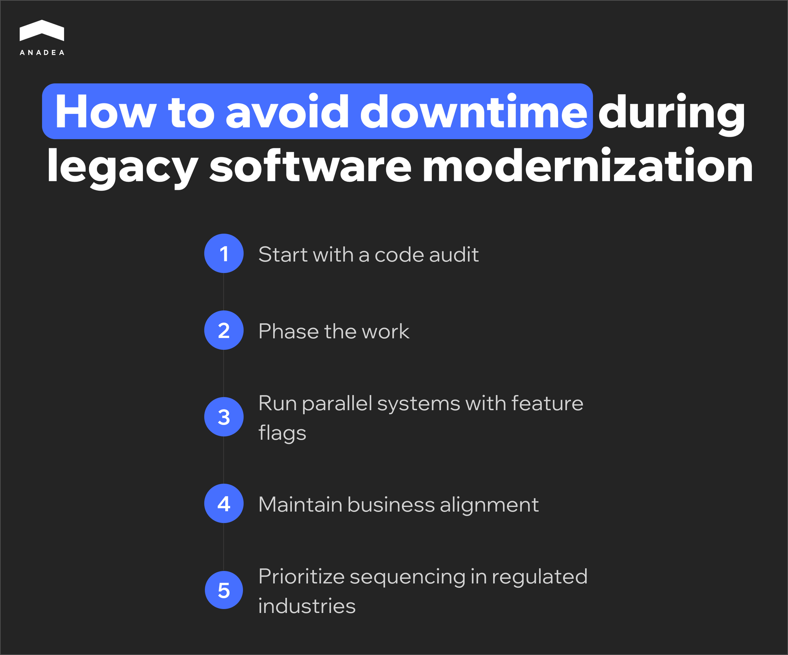

A legacy system needs modernization when the cost of maintaining it exceeds the value of new features, and the team is afraid to touch the code due to unpredictable bugs and an end-of-life stack. There are four modernization strategies (rehost, refactor, re-architect, rebuild) chosen based on downtime tolerance, code state, and budget.

As of 2026, 70% of enterprise apps still rely on legacy tech stacks and, as [Deloitte](https://www.linkedin.com/posts/deloitte_deloitteengineering-etciocloudsummit-aiatscale-activity-7428671907979247616-U8vJ/) reports, maintenance of such systems requires more than 70% of IT budgets. Organizations often postpone upgrades to avoid service interruptions. However, the delay of your legacy software modernization results in a growing maintenance tax in the form of slower releases and higher infrastructure bills.

This article details how to transition to modern architecture without taking your services offline. We will focus on the signals for upgrading legacy systems and the benefits of different modernization approaches. Our goal is to help you choose the path based on your needs and risk tolerance.

## How can I understand that my software is legacy?

The outdated UI itself doesn’t make your system legacy. But when the cost of maintaining your software is higher than the value of the features it can deliver, something goes wrong. It should be a clear sign to you that you need to consider modernization.

To identify the point of no return, look past the dashboard. If your team relies on workarounds to perform basic data syncs, the architecture has already failed. 

The table below can help you quickly audit your current system health.

<table>

<tbody>

<tr>

<td>

<strong>Signal</strong>

</td>

<td>

<strong>Business Cost</strong>

</td>

</tr>

<tr>

<td>

<strong>Fear-driven development</strong>. Engineers don't want to touch core modules because a single change triggers unpredictable regressions elsewhere.

</td>

<td>

Innovation halts because a major part of the sprint is spent on manual QA and emergency hotfixes instead of new features.

</td>

</tr>

<tr>

<td>

<strong>API absence.</strong> Every new integration requires custom middleware or direct database writes instead of standard LTI or RESTful calls.

</td>

<td>

You need to invest large amounts in building connectors between tools instead of launching new revenue-generating functionality.

</td>

</tr>

<tr>

<td>

<strong>End-of-life runtime. </strong>Underlying frameworks or languages no longer receive official security patches.

</td>

<td>

Your system fails basic security audits (SOC2/HIPAA). The risk of serious data breaches is growing.

</td>

</tr>

<tr>

<td>

<strong>Tribal knowledge dependency. </strong>The specialists who had built your system left. Nobody, except for one person on your team, can understand the undocumented code.

</td>

<td>

Your uptime depends on a single person. If they leave, the logic governing your business rules becomes a black box.

</td>

</tr>

</tbody>

</table>

If any of these scenarios sound familiar, that’s a strong sign you should start thinking about legacy application modernization.

## What are the options for modernizing legacy software?

The choice of a modernization path has a direct impact on your capital allocation. You should define where to spend your engineering hours to get the highest ROI on system stability and velocity.

Let’s consider four key legacy modernization strategies.

### Rehost (lift and shift) 

This is the fastest way to get out of a failing data center or a rigid on-premise environment. Typically, rehosting involves legacy application migration from a local server to the cloud without altering the code.

It’s the right move when you need immediate hosting savings or a quick infrastructure win. But this approach to legacy software migration won’t fix your underlying technical debt. The risk here is that you are just moving the existing technical debt to the cloud. As a result, you might end up paying a premium to run inefficient processes on modern hardware. 

Here’s a quick summary of the pros and cons of this approach.

<table>

<tbody>

<tr>

<td>

<strong>Pros of Rehost</strong>

</td>

<td>

<strong>Cons of Rehost</strong>

</td>

</tr>

<tr>

<td>

Speed of modernization

</td>

<td>

Stagnant debt

</td>

</tr>

<tr>

<td>

Simplicity (no code changes needed)

</td>

<td>

Paying higher fees for inefficiency

</td>

</tr>

<tr>

<td>

Quick infrastructure win

</td>

<td>

Relocation risk

</td>

</tr>

</tbody>

</table>

### Refactor

Refactoring is the process of restructuring and optimizing existing code without changing its external behavior or business logic. 

**When to opt-in:**

This is a viable option when your features are exactly what the market needs. But messy code and a lack of documentation have slowed your release velocity.

**When to proceed with caution:**

The most popular mistake is falling into the scope creep trap. Without a software audit beforehand, your team could spend weeks polishing a feature that is obsolete. It makes no sense to optimize the code that should have been deprecated months ago.

Here, you also have another point to keep in mind. If the effort to refactor is approaching 70% of what it would cost to build a module from scratch, stop and consider re-architecting or rebuilding.

### Re-architect

Re-architecting involves a fundamental shift in how the system operates. For instance, it may include breaking a monolithic database into microservices that can scale independently. This legacy system transformation strategy is usually chosen when the problem is not the code, but the architecture itself.

It provides the highest agility for modern integrations. But at the same time, it requires a high level of DevOps maturity to manage the resulting distributed system complexity.

### Rebuild

A total rebuild is a ground-up rewrite of the system, while keeping only the underlying data and business requirements. This is justifiable when the cost of working around the legacy system is higher than the cost of a new build, or when the original language is obsolete.

It offers the most freedom to use modern stacks, but it carries the highest execution risk.

**Why rebuilds often fail:**

Teams try to match a decade’s worth of features in a single launch. It’s a classic mistake that leaves projects stuck in a “90% done” stage for years. 

While this approach gives you the most freedom to use a modern, high-performance stack, it’s also the most dangerous path. It has the highest chance of burning through a budget and never reaching the finish line. 

### Hybrid approach

In practice, modernization is rarely a single-track project. Most successful engineering teams use a hybrid approach.

It is common to see teams lift and shift their database to the cloud for some quick stability while simultaneously performing a re-architecture of their most critical modules. 

When it comes to modernizing legacy systems, there isn’t a model that will work for everyone. Your task should be to identify a specific bottleneck that you need to address. And based on this, you will be able to define the most efficient way to do it.

## How to avoid downtime during legacy software modernization?

A well-elaborated risk mitigation strategy is a must-have. The goal is to make the transition invisible to the end user and ensure that the data remains accurate. Sometimes businesses need to stop their operations to fix the software. But it is the wrong way to perform legacy software migration or modernization.

Based on our practical experience in modernizing legacy systems, we’ve prepared the following tips for you.

### Start with a code audit

Before creating a roadmap, you must map the current state of your software. A comprehensive [code audit](https://anadea.info/services/code-review-service) helps you reveal the hidden traps.

For example, you can find risky modules, untested third-party integrations, undocumented dependencies, and any other issues you haven’t noticed for years. 

As one of the [Reddit users shared](https://www.reddit.com/r/TechIndustryInsights/comments/1rs0ypx/9_legacy_system_modernization_strategies_that/), “the real pain is all the hidden logic inside the system. You touch one thing, and something random breaks three layers away.”

If you don’t know that your software relies on a deprecated 2014 library, your modernization will fail the moment you try to decouple it.

### Phase the work

Use the [Strangler Fig pattern](https://learn.microsoft.com/en-us/azure/architecture/patterns/strangler-fig) to build new functionality as separate microservices around the edges of the old monolith. In this case, for a successful legacy system modernization, you can gradually route a small percentage of live traffic to the new services while the legacy system handles the rest. You retire the legacy components only after the new ones have proven their stability in a production environment.

### Run parallel systems with feature flags

Eliminate the Big Bang cut-over. Use feature flags. With them, as part of legacy system modernization, you can run the old and new logic simultaneously and compare the outputs. If the legacy database returns one result and the new service returns another, it means that you have caught a bug before a customer ever sees it. You should flip the permanent switch when you have 100% data parity. 

### Maintain business alignment

Engineering decisions have operational consequences. For any legacy system modernization project, you need to define upfront which core functions must remain 100% available and who has the authority to sign off on each phase. A [discovery phase](https://anadea.info/services/business-analysis) led by a business analyst is critical here. It will help you make sure that technical milestones align with business requirements. 

### Prioritize sequencing in regulated industries

[Legacy systems in fintech](https://anadea.info/blog/legacy-systems-fintech-future-proofing-roadmap/), healthcare, and other highly regulated industries often face compliance hurdles. You should map GDPR, HIPAA, or PCI-DSS controls into the system design before the first migration sprint begins. 

In these industries, your audit requirements define the build sequence. When you migrate the most sensitive data modules first, you can ensure that the security infrastructure is tested and functional from day one. This helps you remove the need for emergency patches after the transition. 



## Which legacy modernization approach is right for my project?

When selecting a modernization strategy, you should find the approach that can address your needs better than others.

Use these four criteria to filter your options. 

### Downtime tolerance

How much downtime can the business actually survive? An e-commerce checkout needs a slow, module-by-module migration. At the same time, an internal employee survey tool can usually be taken offline for a weekend rebuild without impacting revenue.

If you are managing a core transaction engine or a customer-facing portal, a total rebuild is high-risk. These systems require a phased approach. Consider a refactor or re-architect strategy. It can keep the engine running while you swap the parts.

### Visibility into existing code

What is the actual state of your automated tests and documentation? If your codebase is a black box with zero test coverage, trying to refactor it can be compared with performing surgery in a dark room. In this case, re-architecting or rebuilding is usually a much safer way for system optimization. 

### Team knowledge

Code is a collection of past business decisions. If the original developers left years ago and took that context with them, your current team will spend more time guessing than coding.

If you lack institutional knowledge, refactoring is dangerous. There is a risk that you’ll break hidden dependencies. In this case, rehosting is often the first step to stabilize the system. Once the system is in a modern cloud environment with better observability, your current team can begin re-architecting modules as they reverse-engineer the logic.

### Timeline and budget

Even the best technical solution is useless if it arrives six months after the business needs it. You have to balance the ideal architecture against the actual budget and timeline.

If you need to lower hosting costs by next month, rehosting is your move. If you are planning for a three-year growth cycle and have the capital, a rebuild or re-architect provides the necessary foundation for that scale.

Here’s a summary matrix that helps you find the right legacy application modernization based on your needs.

<table>

<tbody>

<tr>

<td>

<strong>Your primary goal</strong>

</td>

<td>

<strong>Legacy software modernization strategy</strong>

</td>

</tr>

<tr>

<td>

Immediate cost reduction

</td>

<td>

Rehost

</td>

</tr>

<tr>

<td>

Improving release velocity

</td>

<td>

Refactor

</td>

</tr>

<tr>

<td>

System scaling

</td>

<td>

Re-architect

</td>

</tr>

<tr>

<td>

Total digital transformation

</td>

<td>

Rebuild

</td>

</tr>

</tbody>

</table>

## Final word: how to modernize legacy applications with confidence and control

The primary barrier to modernization is the fear of unintended downtime. However, this risk is manageable through specific engineering protocols. 

Modernization with control means removing the guesswork. It starts with a code audit to find the hidden dependencies and ends with a system that is secure by design.

Technical changes should solve business problems. At Anadea, our business analysis team works directly with you to detect your needs and pain points. This approach helps us ensure your improved ROI and operational efficiency. [Share your requirements](https://anadea.info/contacts) with us! And we will help you choose the most appropriate modernization path.
