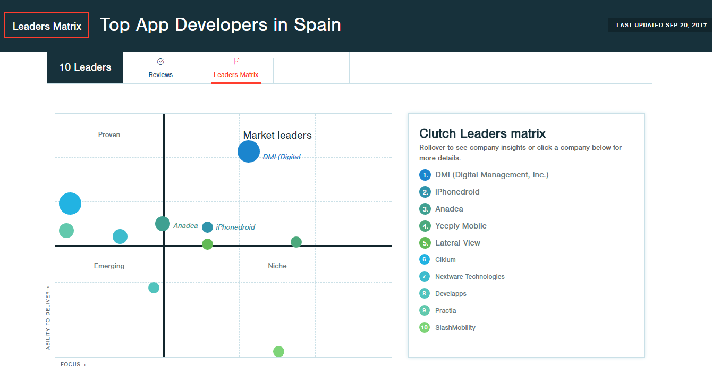

Spaniards have firmly established themselves among the world's biggest smartphone users. The percentage of smartphone owners in Spain has already exceeded 65% of the population and smartphone user penetration is predicted to reach over 71% by 2022. This equals to over 30 million users, which creates a sweet spot for IT business and sparks up the Spanish app development industry.

As an IT company with a wide international outlook, [Anadea](https://anadea.info/) has been making its way to the Spanish software development market for a while. Actually, we achieved quite a lot here. By now, we have many good business partners and clients in Spain. We've worked on a number of exciting and innovative projects for our Spanish clients, including applications for financial and real estate sectors.

What is more, we are proud that our achievements have been noticed and recognized. Several independent research services identified us as one of the leading mobile app development companies in Spain.

## Through hardships to the stars

Being initially based in Ukraine, we were collaborating with our Spanish clients remotely for many years. This approach worked reasonably well, however, it's known that being closer to clients provides certain benefits and helps to be more in touch with local needs.

Eventually, in 2014 we reached the point when it was the right time to extend our international physical presence. We decided to launch several additional development centers abroad and one of them was opened in Spain. Since then we got a chance to meet our Spanish partners face to face which took our services in this region to the new level.

## What makes Anadea one of the best app development companies in Spain?

Certainly, our geographical presence in Spain and proximity of our other offices located in Ukraine and Belarus, are not the only things that allow us building great apps for our Spanish clients. There are many other weighty factors making collaboration with Anadea highly beneficial, just to name a few:

* **Elaborate tech stack.** We use tried and tested technologies for developing efficient mobile apps. Our engineers are versed in native mobile languages, like Swift, Objective-C and Java. As for building multi platform applications, we are good in React Native.
* **Full-stack development capabilities.** We have an in-house team of qualified designers, software engineers and QA experts which allows smoothly bringing mobile apps from initial concept to release in app stores and post-production development.
* **We can do more than mobile apps.** In addition to being an established mobile app development company, we have huge experience in building web and desktop applications of any scale. Thus, if our clients' plans go beyond creating a mobile app, we can handle that!
* **Fair development cost.** We don't seek to offer the cheapest price or the shortest delivery time if it means compromising the quality. Instead, we give realistic estimates. At the same time, due to our roots in Ukraine, famous for its high-skilled IT specialists and attractive prices, we provide our clients with top-notch developers at very reasonable rates.
* **Flexibility and transparency.** We work in agile style which is the best approach for building innovative and user-friendly apps. Besides, continuous communication with clients and transparency of the development process are some of our core values.

## Ranks and ratings

There are many factors that influence the success of a mobile app. An innovative business idea, careful budgeting, well-thought-out promotion strategy are surely critical ones. However, a properly selected tech stack, winning UX/UI design, high-quality implementation of the app functionality and meticulous quality assurance procedures are the elements that are equally decisive. That's why, choosing an IT services provider is an important step as only the best app development companies know how to do it right.

There are many resources, such as research and review platforms or freelance marketplaces with elaborate ranking systems, that help entrepreneurs to find great developers for their projects. And we're proud with the fact that Spain is one of the countries where Anadea holds leading positions among best app developers.

### Clutch's list of top app developers in Spain

<a href="https://clutch.co/" rel="nofollow" target="_blank">Clutch.co</a> is a reputable B2B research service that uses a sophisticated evaluation methodology for identifying leading service providers for key markets. The key dimension of Clutch's rankings is the proven ability to deliver results that satisfy clients and meet their needs. According to Clutch's leaders matrix, Anadea is currently the third best app developer in Spain.

### Other ratings and reviews of Spanish app developers

Clutch is not the only one service that conducts IT services market researches and provides rankings of service providers for various areas and countries. Here are some other lists of top app development companies in Spain:

* **Applancer,** a research and review platform that helps entrepreneurs find qualified app developers. According to a <a href="https://www.applancer.co/blog/hire-these-top-3-trusted-mobile-app-developers-from-spain" rel="nofollow" target="_blank">study conducted by Applancer</a>, Anadea holds the top spot among the app developers in Spain.
* **Yourstory,** a platform for startups and entrepreneurs that, among other things, analyzes the startup ecosystem and mobile app developers. As stated in their <a href="https://yourstory.com/read/67aa125c30-top-10-trusted-mobile-app-development-companies-in-spain-madrid-barcelona" rel="nofollow" target="_blank">list of top 10 trusted mobile app development companies in Spain</a>, Anadea is on the 6th position.

### What our Spanish clients say

One of our [clients](https://anadea.info/projects/viventor), a Spanish-Latvian startup that hired our developers to build Android and iOS apps for their financial investment platform, gave us the following feedback:

> Many thanks to the whole team for the successful release of the new version of our application! Despite the seemingly small amount of innovation compared to the first version, still, the amount of work was extensive. I was pleased with the successful and high-quality communication with our backend team and how the disputed issues were resolved. Special thanks for solving issues outside of working hours! The development of mobile applications for us was a novelty and we gained invaluable experience. Thank you again and good luck in future projects!

You can find more reviews from our clients in our [profile on Clutch](https://clutch.co/profile/anadea).

## Looking for a great app development company?

Anadea is one of the leading app development companies that always strives to deliver the best to the clients. Whether you want to create a new application from scratch or fix issues and add new features to your existing app, we would love to apply our skills to help you with that.

Hopefully, our high rankings and client reviews gave you some reasons to choose our developers for your project. If you still have any doubts, [drop us a line](https://anadea.info/contacts) and let us eliminate your uncertainty!
