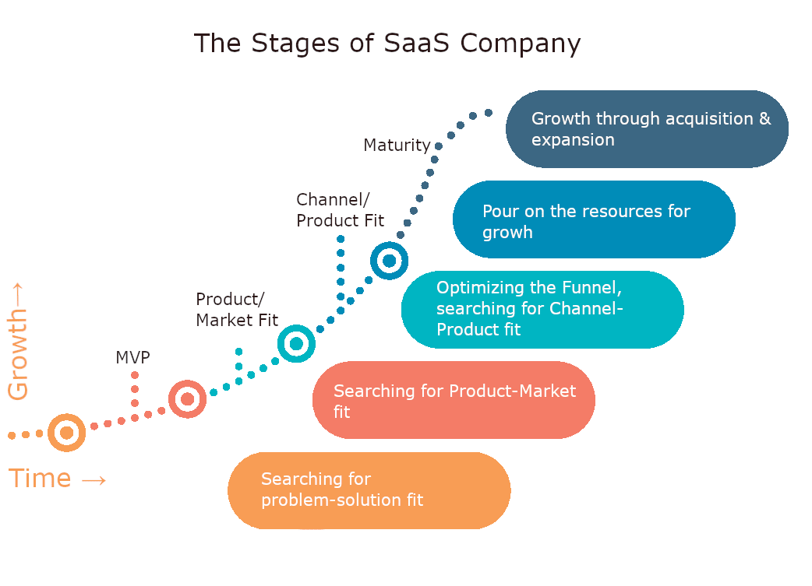
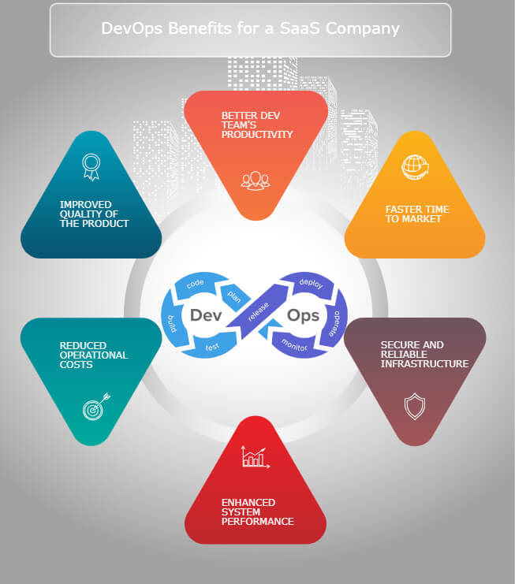

When starting a SaaS-product-based business and hiring a <a href="https://anadea.info/services/saas-development" target="_blank">SaaS app development company</a> to create the desired software, apart from other vital questions businesses want to know who will be in charge of the technical side. While typically custom software development is limited to involving back- and front-end engineers, a designer and a QA specialist, development in the field of cloud-based systems, which SaaS is, often requires a DevOps specialist. In this article, we will explain what they are in charge of and how your SaaS can benefit from DevOps.

## Why DevOps for SaaS is necessary
SaaS companies pass the stages of their evolution from a startup to a successful mature company, like any other business. But their growth is highly dependent on the product life cycle and development life cycle, as, in essence, SaaS is a web-based product hosted on the Internet to which users get access via a browser.

At the startup stage, a core team suggests a software solution that solves the problem by meeting the user's needs, often in the form of an MVP. By the time the MVP grows into a product that fits the market need and provides a competitive service, it experiences a great number of changes. At this stage, the development team plays a very significant role, but the startup may be at risk of limited budget to cover operational costs. So maximum changes here should be made:

* in the shortest possible time (e.g. the reduction of the development cycle by automation)
* without bloating staff (e.g. no need to hire extra team members)
* avoiding irrational use of human resources (for instance, instead of coding, developers are troubleshooting on the servers).

__This was the introductory part—if you've come to learn how DevOps as a Service can be of help in custom SaaS development, you can start reading from here.=)__

The need for a DevOps specialist arises from the very beginning of work on the project. Why so? They can consult on the server architecture, as they know how to build it from the point of view of effective performance. They can assist and set up environments for development, testing and deployment, and also perform a range of other essential tasks.

Those specific tasks that DevOps can solve in a couple of working days, programmers who have not encountered before will be solving much longer, sometimes up to 1-2 weeks. Of course, sooner or later a Middle or Senior-level developer will find the solution, but it may not be an optimal one or not follow the DevOps best practices.

Completing your development team with a full-time DevOps specialist makes sense if the team grows and reaches 5-10 members and the project scales. Otherwise, a DevOps engineer usually works on a part-time basis and dedicates a few hours a week to your project, which also makes them efficient in terms of price.

But still, what is so special a DevOps can do?

## DevOps for SaaS: benefits and best practices
Any DevOps engineer knows and applies these practices. We provide them in the form of glossary for easy navigation.

### CI/CD
_Continuous Integration._ Its key goals are to find and address bugs quicker, improve software quality, and reduce the time it takes to validate and release new software updates.

_Continuous Delivery._ Code changes are automatically built, tested, and prepared for deployment.

### Microservices
_Microservices architecture._ Its main benefits are hosting facility, solution stability and quick recovery. It gives flexibility in using different frameworks or programming languages to write microservices and deploy them.

### Infrastructure as a Code
_Infrastructure_ is provisioned and managed using such coding and software development techniques as version control and continuous integration.

### Monitoring and Logging
Fine-tuned _log management_ ensures quick identification of the fault, while monitoring will help to timely respond to conditions of the system - CPU load, free space on the server, etc.

Finally, we came up with the benefits of the introduction of DevOps best practices in your SaaS organization. They boil down to things in the picture below.

<picture>
 <source srcset="Infographics-DevOps-benefits.jpg">
 
</picture>

## Defining cases when DevOps is useful for SaaS
The cases suggested below are provided as examples of what a SaaS DevOps engineer can do on the project. The variety of DevOps tasks on the project is enormous, and the aim of giving these examples is to provide an approximate understanding of the DevOps functions and how a SaaS can benefit from them.

### At the very start of the project
__Case #1__ At Zero sprint, a DevOps specialist can help with defining the tech stack and architecture of the SaaS solution while planning its future functionality.

__Case #2__ They can set different environments for testing and production.

### On the ongoing project
__Case #3__ Commonly, on an existing project, DevOps starts their work with the research of the system and its documentation. To perform specific tasks, like __setting up CI/CD__, they need:

* to look at what technologies are used
* what kinds of databases are there
* what networks are configured, servers, etc.

This step is needed to get an understanding of what to improve or fix. This phase takes from a few hours to a couple of days, depending on the case.

__Case #4__ A common goal of the SaaS project is to __improve infrastructure and security__. To achieve this goal, a DevOps specialist first researches what works well and what needs to be fixed. They conduct tests and review the infrastructure and evaluate the security measures taken to protect data. Often, the omissions in security are evident immediately without deep immersion, e.g. security groups are poorly configured. While working on these improvements, the downtimes of an app are possible, so coordination and approval from the customer’s side are needed.

__Case #5__ There are cases when against the backdrop of these improvements, DevOps is asked to make __Infrastructure as code (IaC)__. You may find out how they do it and what SaaS DevOps tools they use by <a href="https://anadea.info/free-project-estimate" target="_blank">contacting our team</a>. In a nutshell, IaC automates the development process and speeds up changes. For a SaaS company, this service means simplifying infrastructure management.

__Case #6__ A DevOps consultation also is useful when making a decision of __changing the level of a server class__. A DevOps expert can suggest options for the server characteristics. They make a comparative analysis, estimate costs, possible risks, etc.

__Case #7__ One of the DevOps tasks, constant __server monitoring and system health check__, helps timely respond to conditions of the system - CPU load, free space on the server, etc.

__Case #8__ A great option for a SaaS project is __autoscaling__. To set it up correctly, DevOps engineer makes an analysis of the historical data - how many servers and of what type they are, what was the load on the processor, what was the peak load, etc.

__Case #9__ A fine-tuned log management is essential as it helps identify the malfunction quickly and start solving the problem faster. __Log management__ is one of the best practices that makes development more effective.
As you can see, the range of the tasks is really diverse - from moving your project to a new server, or rebuilding the architecture to microservices, to SaaS release management, DNS and database management, troubleshooting in case of a crash, and much more.

## Conclusions
Thus, the presence of DevOps in SaaS companies shortens the development cycle and frees developers from non-core tasks. But more often, the need for DevOps starts to be evident when it becomes obvious that the development team lacks the specific expertise, faces difficulties, and loses time on troubleshooting.

For the evolution of a <a href="https://anadea.info/guides/how-to-build-a-saas-product" target="_blank">Saas product</a>, recognizing the need for DevOps is a very important step that can significantly affect the quality of the product. __DaaS (part-time or episodic DevOps services outsourcing)__ is a good answer for SaaS startups and developing companies. DevOps as a Service provides the possibility to effectively improve the existing state of affairs on the project without the staff bloat. The positive effects boil down to improved system performance, shorter time to market, cutting down of operational costs, a rise in the development team’s productivity, fast troubleshooting, and more secure and reliable infrastructure.

Hire DevOps engineers

## Frequently Asked Questions
### What is DevOps?
DevOps (“development” + “operations”) refers to a set of measures to speed up software performance and assure software security. This is achieved via optimizing and improving environments and infrastructure and such DevOps best practices as CI/CD, use of microservices over monolith architecture, logging & monitoring, and more. DevOps engineer’s job runs in the background and is not obvious to the naked eye, but it still plays major role in platform’s success. Here are some of the tasks Anadea’s DevOps engineers perform:
* Moving software to a new server
* Server maintenance & Server administration
* Troubleshooting in case of a crash
* Project health check
* DNS management
* Database management
* IT infrastructure management
* and DevOps consulting (DevOps advisory service) in case there is a need that you can’t articulate yet.

### Why is DevOps important for SaaS?
The common advantages of SaaS platforms are well-known already. These are fast delivery of updates, convenience, and accessibility of software through multiple platforms. However, __all these only stay relevant in the long run if the system configuration is perfect and constantly maintained__. Cloud systems are more complex compared to installable software and thus are harder to build, hence the additional effort to maintain them is needed. There are many software engineers capable of writing code and performing the tasks of DevOps at the same time, but think about whether you are ready to pay for extra hours since a professional SaaS DevOps engineer can do their tasks x2 faster than engineers with no such focus.

### Where can I find a DevOps engineer for my project?
Outsourcing software development companies and independent professionals offer a DevOps engineering service and put their proposals online, so as a first step you might want to google “hire DevOps engineer for SaaS project” or something similar. The results will highlight many offerings from freelancers and company-based specialists. Choose what suits you best from reviews, used SaaS DevOps tools, the price point, etc. or other parameters you find important.

### Outsourced vs in-house DevOps engineers, which is better?
When comparing in-house DevOps engineer and DevOps as a Service provider, both will have their perks and pitfalls, but at the end of the day, it all comes down to the resources the company has at its disposal. Hiring an in-house DevOps, not to mention a whole DevOps team, may sound like a good idea, but it brings along lots of expenses on recruiting, onboarding, salaries, insurance, computers and other operational needs.

In other words, in addition to paying for maintaining your SaaS, you’ll be paying for maintaining personnel. This may be reasonable if you’re planning to grow a solid tech business and develop software projects long-term—in this case, it is great to have such involved and committed specialists on board. Otherwise, it seems like a better idea to outsource development operations to a company specializing in commercial software development that knows what they do and is experienced in delivering technical solutions and communicating with businesses in their language.

If outsourcing is what you choose, don’t hesitate to contact Anadea. SaaS development, code audit and DevOps are what we’ve been doing for 20+ years and hope to be doing for as many.
