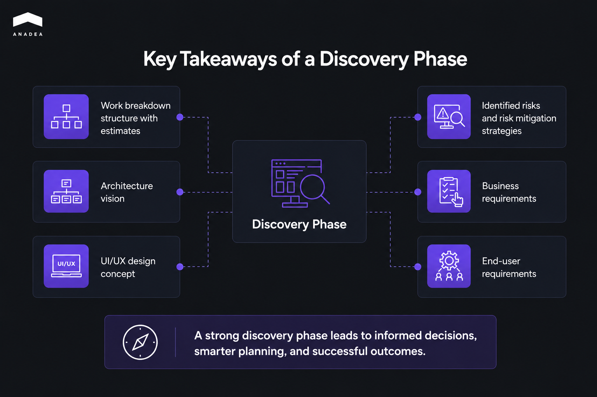

The project discovery phase is a structured pre-development stage where stakeholders and engineers align on scope, requirements, and architectural constraints before any code gets written. It typically runs 3 to 6 weeks and wraps up with a concrete set of deliverables (a vision document, functional decomposition, technical specification, and wireframes). 

The primary impulse for most founders to bypass the discovery phase is to shorten the time-to-market. This stage is often discarded as a friction point that delays the first sprint. 

However, skipping discovery still doesn’t eliminate the need for well-informed decisions based on real-life needs. By the time you realize a feature doesn’t align with user expectations, you have already invested in the backend architecture. Such a situation can force you to start over again.

According to a [study of 5,400+ IT projects](https://www.mckinsey.com/capabilities/tech-and-ai/our-insights/delivering-large-scale-it-projects-on-time-on-budget-and-on-value) conducted by McKinsey and the BT Centre for Major Programme Management at the University of Oxford, large projects typically exceed budgets by around 45%. This is often a consequence of poor research at the planning stage.

In this article, we are going to talk about the benefits of discovery phase and explain whether (and when) it can be skipped.

## What Is the Discovery Phase in Software Development? 

A [product discovery phase](https://anadea.info/services/product-discovery) is a structured pre-development stage where stakeholders and engineers align on scope and architectural constraints. It is a high-intensity period of technical de-risking that should take place before proceeding to code writing. 

The development can turn into a guessing game if you don’t have a clear definition of requirements.

The discovery process usually takes 3 to 6 weeks, and the tangible result of this phase is a concrete project toolkit. The discovery phase deliverables include:

* Vision document and roadmap (definition of the reasons behind building each feature and the delivery sequence);
* Functional decomposition (breakdown of the monolith into manageable tasks);
* Technical specification and architecture scheme (description  of the tech stack, API integrations, and data flow);
* Wireframes (low-fidelity UX blueprints for logic validation before design).

In our practice, we faced situations when our customers believed that skipping the discovery phase could lead to significant time savings. In reality, such a decision can lead to opposite results.

The table below demonstrates clear differences between projects with discovery and without it.

<table>

<thead>

<tr>

<th>

<strong>Aspect for Comparison</strong>

</th>

<th>

<strong>Projects without Discovery</strong>

</th>

<th>

<strong>Projects with Discovery</strong>

</th>

</tr>

</thead>

<tbody>

<tr>

<td>

Timeline

</td>

<td>

Indefinite

</td>

<td>

Fixed (milestone-based)

</td>

</tr>

<tr>

<td>

Rework rate

</td>

<td>

High (due to missed considerations)

</td>

<td>

Low

</td>

</tr>

<tr>

<td>

Cost accuracy

</td>

<td>

Low

</td>

<td>

High

</td>

</tr>

<tr>

<td>

Risk management

</td>

<td>

Reactive

</td>

<td>

Proactive

</td>

</tr>

</tbody>

</table>



## What Happens If We Skip Project Discovery Phase?

The main aspects that are affected by the lack of proper research before the development starts are your budget and time-to-market. 

Though the development community sometimes [dismisses the necessity of this phase](https://www.reddit.com/r/ProductManagement/comments/1607vbh/comment/jxlre77/?utm_source=share&utm_medium=web3x&utm_name=web3xcss&utm_term=1&utm_content=share_button), a lot of Reddit users highlight its importance. One of them wrote: “Discovery is to understand the problem-solution space better. If you don't understand the problem well enough, it will take you a longer time to come up with the right solution, even if you're shipping fast.”

Here are the potential risks of skipping this phase.

### Scope Creep

A lack of a functional decomposition agreed upon upfront can turn your scope into a moving target. 

If requirements shift mid-sprint, developers have to rewrite existing modules to accommodate the new logic. Every change through the codebase can bloat the timeline and turn an MVP into a half-finished monolith.

### Budget Leak: Rule of Ten

The later a change is introduced in the software development lifecycle, the more expensive it becomes. According to estimates, fixes at the next stage of the development process can cost 10 times more in terms of time and money than at the previous one.

The table below outlines the potential expenses. 

<table>

<tbody>

<tr>

<td>

<strong>Project Phase</strong>

</td>

<td>

<strong>Cost of Fix</strong>

</td>

<td>

<strong>Typical Impact</strong>

</td>

</tr>

<tr>

<td>

Discovery

</td>

<td>

1 unit

</td>

<td>

The need to update a technical blueprint or requirement specification

</td>

</tr>

<tr>

<td>

Development

</td>

<td>

10 units

</td>

<td>

Refactoring integrated code and database schemas mid-sprint

</td>

</tr>

<tr>

<td>

Post-launch

</td>

<td>

100 units

</td>

<td>

Emergency fixes, data recovery, reputational damage

</td>

</tr>

</tbody>

</table>

### Delivering the Wrong Solution

Engineering teams often have strong skills in solving problems. However, without discovery, they may start solving the wrong ones.

A business may invest $100K in building a complex dashboard that admins never use. It may happen because the real bottleneck was a manual CSV import process that discovery would have identified. As a result, a company ends up with a high-fidelity product that delivers zero business value as it wasn't aimed at addressing the actual operational pain points.

### Double-Spend Cycle

Let’s imagine that a company hires developers who immediately get a task to start coding. Six months later, the results may be rather disappointing. The product has a lot of bugs. The architecture can’t scale past a very limited number of concurrent users. Moreover, there is no documentation.

It’s very difficult to save this project without additional investments. This all leads to the situation where the company has to scrap the entire codebase and pay a second development team to build it correctly from scratch. 

What is the result? Double payments of the project cost and lost market timing.



## How Much Does It Cost to Skip Discovery Phase?

Contrary to expectations, eliminating the project discovery phase from the development cycle defers costs and adds a massive interest rate. The cost of rework is much higher than the cost of discovery. 

Let’s take a closer look at expenses resulting from the skipped discovery phase.

### Direct Costs 

You bill rework at the same hourly rate as new feature development. Every hour spent refactoring a database schema or patching logic gaps is negative progress. Rework drains your budget and pushes your launch date further out. 

From our experience, we know that emergency fixes during the final sprint are the most expensive way to build software.

### Indirect Costs

Blown deadlines destroy market timing and erode stakeholder trust. Moreover, constant friction over shifting requirements has a negative impact on your development team. This leads to:

* Talent churn;
* velocity loss;
* strategic misalignment;
* operational friction. 

### Opportunity Costs 

When you need to invest in rework and fixes, you usually take money from the budget that can be spent on innovation. Due to this, you are often forced to cut competitive differentiators just to maintain core operations.

The key risk here is to end up with a product that functions, but never fits the problem it was meant to solve.

## Do I Need a Product Discovery Phase for My Project? 

At Anadea, we always stay honest with our clients. We never insist on performing any extra actions that can be skipped without a negative effect on the final result.

To understand whether you need discovery, it is important to take into account the state and peculiarities of your project.

**You should commit to a discovery phase if:**

* Your product involves complex workflows, multiple user roles, or third-party API orchestrations (for instance, Stripe, Salesforce, or custom LMS).
* You have a clear vision. But at the moment, there isn’t a granular feature set. If developers start coding in this state, you can get a ["Frankenstein" architecture](https://community.sap.com/t5/technology-blog-posts-by-members/sap-btp-integration-suite-clean-architecture-vs-the-frankenstein-landscape/ba-p/14301527).
* Your company plans to secure investor funding, and technical documentation is highly required.
* You need a high-fidelity prototype to validate the UX with actual users.

**You can skip it if:**

* The scope is strictly defined, and our team confirms that it is technically clear.
* You are performing routine maintenance or adding minor, isolated features to a live product where the architecture is already documented.

## How Does the Discovery Phase Work at Anadea?

Our product discovery process is a rigorous extraction of requirements for building your solution in full alignment with your vision. Our main task at this step is to find out why your current systems are failing and where the data bottlenecks are.

The process includes several steps.

### Requirement Gathering

We conduct a series of workshops and stakeholder interviews. They allow us to identify every business rule and edge case before we discover them mid-sprint.

### User Persona Definition

Knowing who the product serves is obligatory. An admin managing 500 records needs a different UI/UX architecture than a student who accesses the portal via a mobile device.

### Existing System Audit

Our experts evaluate your legacy stack and third-party API integrations. If we catch an integration conflict with your current ERP at this stage, we prevent a total development halt three months later.

### Multi-Dimensional Risk Analysis

Our [business analysis](https://anadea.info/services/business-analysis) for the discovery phase evaluates the project through three critical lenses: 

* **Technical.** Can the chosen stack handle your projected load?
* **Operational.** Will your team actually be able to maintain this?
* **Financial.** Is the ROI justified by the development cost?

Discovery is a collaborative sprint, where we need your active participation. Typically, we require between 3 and 5 hours per week from your key decision-makers.

We need your knowledge of workflows and current systems. Otherwise, we will need to work only with assumptions.

At the end of this phase, you will have a full set of discovery phase deliverables (functional specification, development roadmap, wireframes, architecture scheme).

## Final Word: How Project Discovery Phase Saves You from Higher Expenses

Mistakes in software development are expensive. Discovery is the only phase where you can afford to be wrong.  When you allocate time in advance to strengthen your requirements, you can be sure that your coding budget will go toward building features with real-life value.

Marketing-led assumptions are not the most reliable foundation for your architecture. And at Anadea, we can help you exclude them from your technical decision-making. Our experts will study your needs and find the hidden problems that often crash budgets, like messy data or inefficient integrations. [Contact us](https://anadea.info/contacts) to talk about your project.
