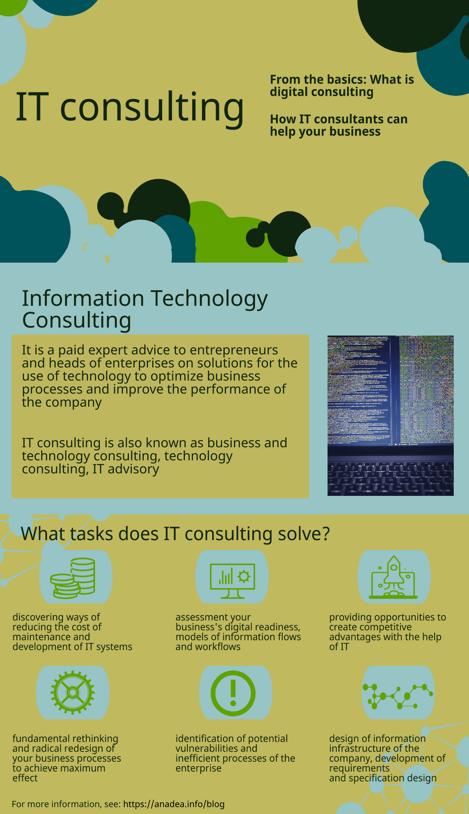
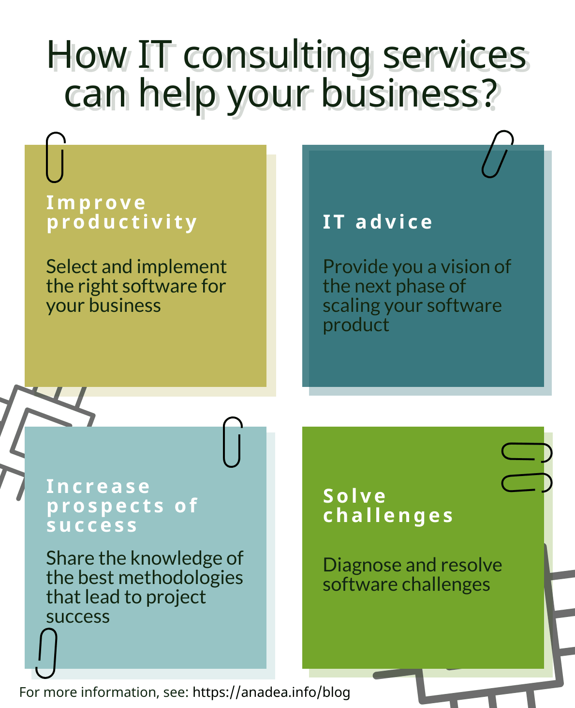
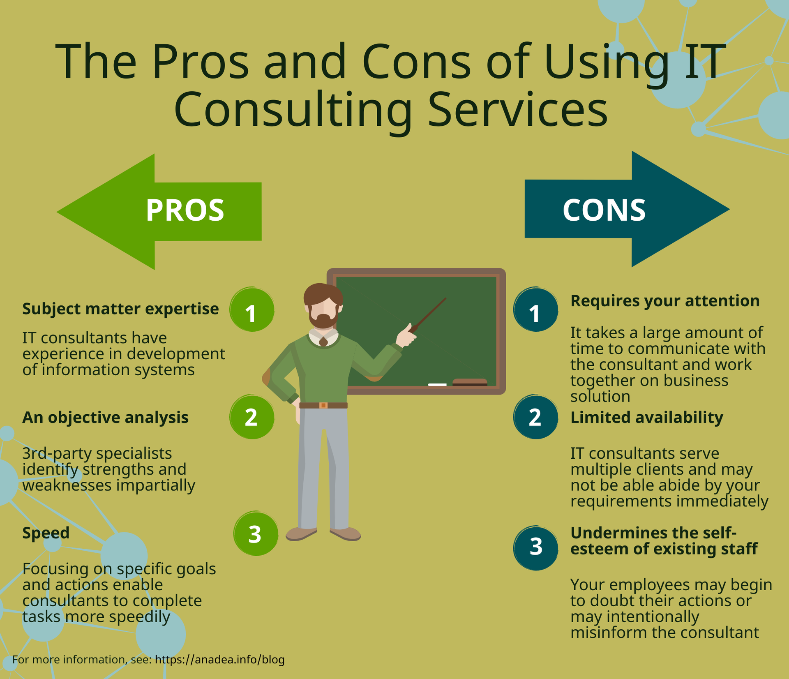

There are many opinions about digital technology consulting. Some people think that consultants set crazy rates and at the same time do not bring any benefit. Some even had a negative experience working with IT consultants.

Information technologies make business more projected and manageable. However, the adoption of information technology in business is complicated by the problem of misunderstanding: the business does not understand what to expect from IT, and IT companies can not always convey the idea in an accessible language.

<a href=https://anadea.info/services/consulting-and-audit>Anadea has been engaged in digital strategy consulting</a> since 2000, helping companies, in particular from healthcare, real estate and education domains, solve specific problems and maintain market relevance through new digital channels. Based on our experience we will clarify why you should start your project with consultation rounds and what benefits it can bring to your business.

## What IT consulting involves

Digital tech consulting is an advisory service provided for businesses interested in efficiency enhancement and getting rid of components that do not contribute to the achievement of business goals. Software consulting services include technical analysis, analysis of business processes, a justification for the use of innovations taking into account business circumstances.

## Why digital consulting is needed for business?

The digital environment covers everything related to software. It may be websites, mobile apps, intranets, social channels, other software solutions for business. Digital is the most efficient way in terms of business analysis capabilities, sales channels, communication with the audience, automation of business processes. But at the same time, it is the fastest-changing environment. A software solution that is suitable for one business may not work for another. Moreover, a software solution that met the needs of your business yesterday may not be able to cope with this task tomorrow.

Since digitization consultants work at the intersection of several areas - management and digital technologies, they understand the context and goals of a business and the power of information technology. Such a combination of knowledge makes an IT consultant a valued partner in <a href="https://anadea.info/blog/digital-transformation" target="_blank">digital transformation</a>.

As for tech products on an idea stage, IT consulting is a must. It seems to many startup owners that they know in detail how to develop their software project and what tasks need to be solved in the first place. As our practice over 20+ years shows, this is a big illusion. For various reasons, such startup owners forget, inter alia, essential non-functional requirements - protection of personal data, extensibility, legal requirements, external interfaces, which subsequently will lead to significant challenges in further development. Digital business consultants help to polish the product idea to perfection from the very beginning which reduces the further change requests costs and <a href="https://anadea.info/blog/why-startups-benefit-from-a-code-audit-when-scaling">makes it easy to scale a software product</a>.

## What digital consulting can give your business

Today it's not enough just to make a website or a mobile app and think that you have built an empire and now revenues will grow with every hour. All digital elements in your company, whether an app, website or any other software, must be systematically linked to each other and be part of a deliberate strategy. This is the challenge that a digital consulting analyst faces. The companies that make use of digital business consulting services receive the following.

### Saving money

At the first moment, the money spent on digital strategy and consulting is seen as a cost. But IT consulting viewed in the long run is more likely investment in business development. Consulting provides an opportunity to think over and change the direction of work even before the start of development, and not in the process. It can significantly reduce your costs on development.

### Assessing the digital presence of your business

An IT consultant draws a comprehensive overview of technology workflows in digital channels used by your business. Such a clear picture of the overall digital state determines how you should invest in the future.

### Digital audit

The main goal of a digital audit is to increase your profits by identifying and correcting errors. During the audit, consultants assess the digital maturity of your business by working up each parameter of your software product, <a href="https://anadea.info/blog/what-to-focus-on-when-making-a-code-review">reviewing code</a> and identifying potential vulnerabilities. The audit conducted by experts takes into account the specifics of your business. As a result, you will get a solution to eliminate any shortcomings.

### Establish a detailed development plan

The IT consulting agency finds out where to reduce costs and how exactly to increase the profit of a particular company by <a href="https://anadea.info/guides/user-persona-for-startups">collecting business requirements</a>, delving into business logic, analyzing management processes. A detailed review of the current state of the company helps to make its digital development strategy more successful and achieve a long-term competitive advantage.

### Ensure vision and concept

Digital consulting provides information architecture by structuring the flow of data on how the system and users will interact. Consultants also focus on wireframes to requirements to prove your vision of the product feature. As a result, you get optimal functionality and navigation capabilities.

### The pros and cons of hiring IT consultants

There are lots of reasons for using an external technology consultant. The IT advisers add specific knowledge and skills that your team may not have. Consulting provides an expert and unbiased assessment of your software. Whether this software satisfies business processes requirements best, whether it is secure, whether it is reliable and effective.

However, there are some points to the disadvantage of external IT consulting. You will need to spend a lot of time communicating with consultants on a business solution. Yes, they can work without your participation, but the result is unlikely to meet your specific needs. In some cases, engaging third-party consultants may potentially undermine your internal team's self-confidence.

## The best advice for hiring the right digital consulting firm

When you turn to any consulting agency, you pay for their advice, knowledge and experience, which your employees lack. A consulting firm can not only offer a solution but implement it. Thus, experienced consultancy companies can save millions of dollars, but for the expenses on consultants to pay off, you should choose consultants wisely.

**Here is how to choose an IT consulting firm that will solve the problem and fulfill the task in a high-quality manner:**

- **Determine the goals as accurately as possible.** If you do not know what you want, the consulting company will try to gently impose their views and explain what you should want in the context of their services and competencies. The wrong example: cut costs. The correct example: the company's costs related to IT services reduced by 15% by January 2025.

- **Check whether their experience is proven and relevant.** For some projects, there is no need in the industry experience, for other relevant expertise of IT consultants is a must. The digital transformation of various industries requires different approaches and specific non-technological knowledge. Thus, digital healthcare consultants are familiar with healthcare regulations, procedures of diagnosing and treatment, eLearning consultants can add a new valuable feature to your existing LMS or custom courses. Ask as many questions as possible to consultants about their experience in similar to your projects. How large were these projects and does the consulting agency have written recommendations from clients?

- **Choose those who say "Let's look at how we can help you" instead of "We can offer you".** Consultants are like physicians. If he, after 5 minutes of talking, suggests you taking a pill even before making a diagnosis and finding out the causes of the disease - then, most likely, this is a trading agent of a pharmaceutical company whose goal is to sell you something instead of solving your problem. Evaluate the approach of IT consultants, whether they try to understand your goals and tasks, whether they ask for additional information about your current situation. Digital business strategy consultants who are self-oriented are unlikely to change their focus on solving your business problems.

## Beautiful closing credits

The task of an IT consulting team is to figure out what needs to be automated in a particular company, what the effect will be, choose the appropriate IT solution for this task and implement it. Choosing an experienced digital consulting firm allows your business to grow in terms of management, sales and marketing.

